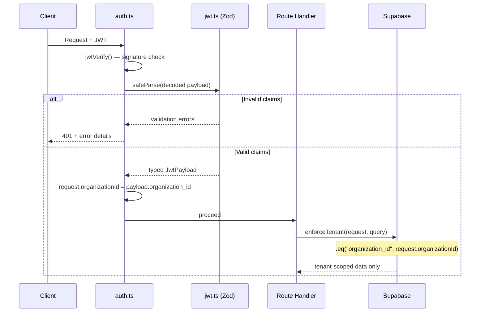
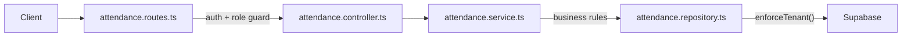

# FieldTrack 2.0 Backend — Walkthrough

## Phase 0 — Project Scaffolding

Fastify + TypeScript backend scaffold with JWT, structured logging, modular routing, Docker, and domain placeholders.

**Deviation:** replaced `ts-node-dev` with `tsx watch` (ESM compat) and added `pino-pretty` dev dep.

---

## Phase 1 — Secure Tenant Isolation Layer

### Files Changed / Created

| File | Action | Purpose |
|------|--------|---------|
| [jwt.ts](file:///d:/Codebase/FieldTrack-2.0/backend/src/types/jwt.ts) | **NEW** | Zod v4 schema for JWT payload (`sub`, `role`, `organization_id`) |
| [global.d.ts](file:///d:/Codebase/FieldTrack-2.0/backend/src/types/global.d.ts) | **MODIFIED** | Wires `JwtPayload` into Fastify types + adds `organizationId` to request |
| [auth.ts](file:///d:/Codebase/FieldTrack-2.0/backend/src/middleware/auth.ts) | **MODIFIED** | JWT verify → Zod validate → attach tenant context (or 401) |
| [tenant.ts](file:///d:/Codebase/FieldTrack-2.0/backend/src/utils/tenant.ts) | **NEW** | `enforceTenant()` — scopes any query to `request.organizationId` |

### How Tenant Enforcement Works



**Key guarantees:**
1. **No trust without validation** — decoded JWT is always schema-checked via Zod
2. **Tenant context is mandatory** — missing `organization_id` → 401
3. **Role enforcement** — only `ADMIN` or `EMPLOYEE` accepted
4. **Query-level isolation** — `enforceTenant()` ensures all DB queries are org-scoped
5. **Type safety everywhere** — `request.user` and `request.organizationId` are fully typed

---

## Phase 2 — Attendance Module (Check-in / Check-out)

### Architecture: Route → Controller → Service → Repository



### Files Created

| File | Layer | Purpose |
|------|-------|---------|
| [attendance.schema.ts](file:///d:/Codebase/FieldTrack-2.0/backend/src/modules/attendance/attendance.schema.ts) | Types | DB row type, Zod pagination schema, response interfaces |
| [attendance.repository.ts](file:///d:/Codebase/FieldTrack-2.0/backend/src/modules/attendance/attendance.repository.ts) | Repository | Supabase queries — all scoped via `enforceTenant()` |
| [attendance.service.ts](file:///d:/Codebase/FieldTrack-2.0/backend/src/modules/attendance/attendance.service.ts) | Service | Business rules: no duplicate check-in, no check-out without open session |
| [attendance.controller.ts](file:///d:/Codebase/FieldTrack-2.0/backend/src/modules/attendance/attendance.controller.ts) | Controller | Extract request data, call service, return `{ success, data }` |
| [attendance.routes.ts](file:///d:/Codebase/FieldTrack-2.0/backend/src/modules/attendance/attendance.routes.ts) | Routes | 4 endpoints with auth middleware, ADMIN guard on org-sessions |
| [supabase.ts](file:///d:/Codebase/FieldTrack-2.0/backend/src/config/supabase.ts) | Config | Supabase client singleton (service role key) |
| [role-guard.ts](file:///d:/Codebase/FieldTrack-2.0/backend/src/middleware/role-guard.ts) | Middleware | Reusable `requireRole()` factory — 403 on role mismatch |
| [errors.ts](file:///d:/Codebase/FieldTrack-2.0/backend/src/utils/errors.ts) | Utils | Added `ForbiddenError` (403) |

### Endpoints

| Method | Path | Auth | Description |
|--------|------|------|-------------|
| POST | `/attendance/check-in` | JWT | Check in (rejects if open session exists) |
| POST | `/attendance/check-out` | JWT | Check out (rejects if no open session) |
| GET | `/attendance/my-sessions` | JWT | Employee's own sessions (paginated) |
| GET | `/attendance/org-sessions` | JWT + ADMIN | All org sessions (paginated) |

### Business Rules

- **EMPLOYEE**: Can only check in if no open session; can only check out if an open session exists; cannot see other users' sessions
- **ADMIN**: Can view all sessions in their org via `/org-sessions`; cannot access other orgs
- **Tenant isolation**: Every DB query passes through `enforceTenant()`, enforcing `.eq("organization_id", ...)`
- **Query chain**: `enforceTenant()` is called before terminal operations (`.single()`, `.range()`) to preserve the filter builder type

### Example curl Requests

```bash
# Check in (requires valid JWT)
curl -X POST http://localhost:3000/attendance/check-in \
  -H "Authorization: Bearer <JWT_TOKEN>"

# Check out
curl -X POST http://localhost:3000/attendance/check-out \
  -H "Authorization: Bearer <JWT_TOKEN>"

# My sessions (paginated)
curl "http://localhost:3000/attendance/my-sessions?page=1&limit=20" \
  -H "Authorization: Bearer <JWT_TOKEN>"

# Org sessions (ADMIN only)
curl "http://localhost:3000/attendance/org-sessions?page=1&limit=20" \
  -H "Authorization: Bearer <ADMIN_JWT_TOKEN>"
```

### Verification Results

| Check | Result |
|-------|--------|
| `npm run build` (tsc) | ✅ Zero errors |
| `npm run dev` (tsx watch) | ✅ Server starts on `0.0.0.0:3000` |
| `GET /health` | ✅ `{"status":"ok","timestamp":"..."}` |

---

## Phase 3 — Location Ingestion System

### Files Created

| File | Layer | Purpose |
|------|-------|---------|
| [locations.schema.ts](file:///d:/Codebase/FieldTrack-2.0/backend/src/modules/locations/locations.schema.ts) | Types | DB row type, Zod schema (`latitude`, `longitude`, `accuracy`, `recorded_at`), response interfaces |
| [locations.repository.ts](file:///d:/Codebase/FieldTrack-2.0/backend/src/modules/locations/locations.repository.ts) | Repository | Supabase `createLocation` and `findLocationsBySession`, scoped via `enforceTenant()` |
| [locations.service.ts](file:///d:/Codebase/FieldTrack-2.0/backend/src/modules/locations/locations.service.ts) | Service | Business rules: verify open attendance session before insertion |
| [locations.controller.ts](file:///d:/Codebase/FieldTrack-2.0/backend/src/modules/locations/locations.controller.ts) | Controller | Extract request data, Zod payload validation, delegate to service, format responses |
| [locations.routes.ts](file:///d:/Codebase/FieldTrack-2.0/backend/src/modules/locations/locations.routes.ts) | Routes | 2 endpoints, both restricted to `EMPLOYEE` via role guard |

### Endpoints

| Method | Path | Auth | Description |
|--------|------|------|-------------|
| POST | `/locations` | JWT + EMPLOYEE | Record GPS point (body: lat, lng, acc, recorded_at) |
| GET | `/locations/my-route?sessionId=...` | JWT + EMPLOYEE | Get ordered location history for an active/past session |

### Business Rules

- **Attendance Dependency**: An employee *must* have an open attendance session (checked via `attendanceRepository.findOpenSession`) to record a location. 
- **Time Validation**: `recorded_at` cannot be more than 2 minutes in the future (enforced via Zod refinement).
- **Coordinate Bounds**: Latitude between `-90` and `90`, Longitude between `-180` and `180`.
- **Role Guarding**: Location ingestion is strictly limited to `EMPLOYEE` role. `ADMIN` cannot POST locations on behalf of an employee.

### Suggested Database Indexes (Phase 3 Prep)

Since `findLocationsBySession` orders by `recorded_at`, and queries are scoped to `session_id`, the `locations` table requires the following index in PostgreSQL to remain performant at scale:

```sql
CREATE INDEX idx_locations_session_recorded_at ON locations(session_id, recorded_at ASC);
```

If tenant-scoped analytics are added in the future over raw locations, a broader compound index will be needed:
```sql
CREATE INDEX idx_locations_tenant_search ON locations(organization_id, user_id, recorded_at DESC);
```

### Example curl Requests

```bash
# Record location (requires open attendance session)
curl -X POST http://localhost:3000/locations \
  -H "Authorization: Bearer <EMPLOYEE_JWT>" \
  -H "Content-Type: application/json" \
  -d '{
    "latitude": 37.7749,
    "longitude": -122.4194,
    "accuracy": 15.5,
    "recorded_at": "2026-03-03T10:00:00Z"
  }'

# Get location route for an existing session
curl "http://localhost:3000/locations/my-route?sessionId=a1b2c3d4-..." \
  -H "Authorization: Bearer <EMPLOYEE_JWT>"
```
