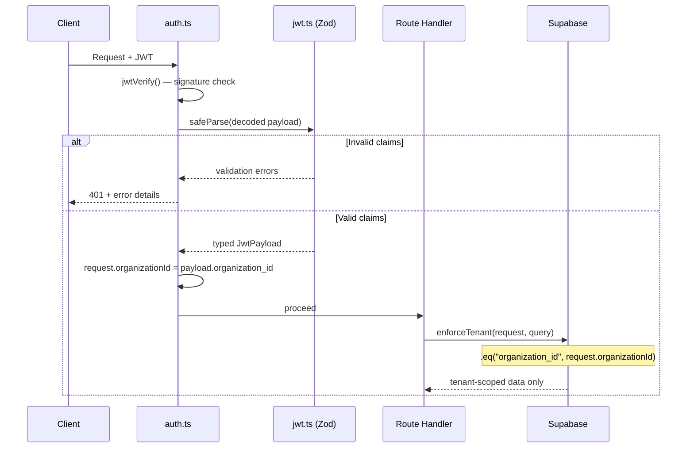
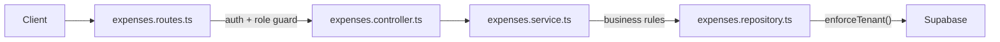
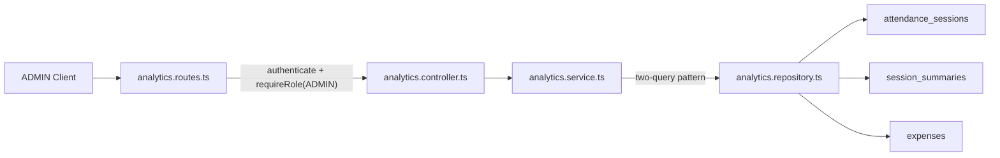
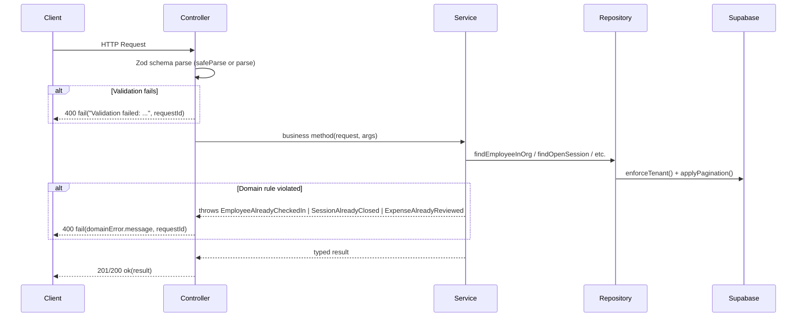

# FieldTrack 2.0 Backend — Walkthrough

## Phase 0 — Project Scaffolding

Fastify + TypeScript backend scaffold with JWT, structured logging, modular routing, Docker, and domain placeholders.

**Deviation:** replaced `ts-node-dev` with `tsx watch` (ESM compat) and added `pino-pretty` dev dep.

---

## Phase 1 — Secure Tenant Isolation Layer

### Files Changed / Created

| File | Action | Purpose |
|------|--------|---------|
| [jwt.ts](file:///d:/Codebase/api/apps/api/src/types/jwt.ts) | **NEW** | Zod v4 schema for JWT payload (`sub`, `role`, `organization_id`) |
| [global.d.ts](file:///d:/Codebase/api/apps/api/src/types/global.d.ts) | **MODIFIED** | Wires `JwtPayload` into Fastify types + adds `organizationId` to request |
| [auth.ts](file:///d:/Codebase/api/apps/api/src/middleware/auth.ts) | **MODIFIED** | JWT verify → Zod validate → attach tenant context (or 401) |
| [tenant.ts](file:///d:/Codebase/api/apps/api/src/utils/tenant.ts) | **NEW** | `enforceTenant()` — scopes any query to `request.organizationId` |

### How Tenant Enforcement Works



**Key guarantees:**
1. **No trust without validation** — decoded JWT is always schema-checked via Zod
2. **Tenant context is mandatory** — missing `organization_id` → 401
3. **Role enforcement** — only `ADMIN` or `EMPLOYEE` accepted
4. **Query-level isolation** — `enforceTenant()` ensures all DB queries are org-scoped
5. **Type safety everywhere** — `request.user` and `request.organizationId` are fully typed

---

## Phase 2 — Attendance Module (Check-in / Check-out)

### Architecture: Route → Controller → Service → Repository


### Files Created

| File | Layer | Purpose |
|------|-------|---------|
| [attendance.schema.ts](file:///d:/Codebase/api/apps/api/src/modules/attendance/attendance.schema.ts) | Types | DB row type, Zod pagination schema, response interfaces |
| [attendance.repository.ts](file:///d:/Codebase/api/apps/api/src/modules/attendance/attendance.repository.ts) | Repository | Supabase queries — all scoped via `enforceTenant()` |
| [attendance.service.ts](file:///d:/Codebase/api/apps/api/src/modules/attendance/attendance.service.ts) | Service | Business rules: no duplicate check-in, no check-out without open session |
| [attendance.controller.ts](file:///d:/Codebase/api/apps/api/src/modules/attendance/attendance.controller.ts) | Controller | Extract request data, call service, return `{ success, data }` |
| [attendance.routes.ts](file:///d:/Codebase/api/apps/api/src/modules/attendance/attendance.routes.ts) | Routes | 4 endpoints with auth middleware, ADMIN guard on org-sessions |
| [supabase.ts](file:///d:/Codebase/api/apps/api/src/config/supabase.ts) | Config | Supabase client singleton (service role key) |
| [role-guard.ts](file:///d:/Codebase/api/apps/api/src/middleware/role-guard.ts) | Middleware | Reusable `requireRole()` factory — 403 on role mismatch |
| [errors.ts](file:///d:/Codebase/api/apps/api/src/utils/errors.ts) | Utils | Added `ForbiddenError` (403) |

### Endpoints

| Method | Path | Auth | Description |
|--------|------|------|-------------|
| POST | `/attendance/check-in` | JWT | Check in (rejects if open session exists) |
| POST | `/attendance/check-out` | JWT | Check out (rejects if no open session) |
| GET | `/attendance/my-sessions` | JWT | Employee's own sessions (paginated) |
| GET | `/attendance/org-sessions` | JWT + ADMIN | All org sessions (paginated) |

### Business Rules

- **EMPLOYEE**: Can only check in if no open session; can only check out if an open session exists; cannot see other users' sessions
- **ADMIN**: Can view all sessions in their org via `/org-sessions`; cannot access other orgs
- **Tenant isolation**: Every DB query passes through `enforceTenant()`, enforcing `.eq("organization_id", ...)`
- **Query chain**: `enforceTenant()` is called before terminal operations (`.single()`, `.range()`) to preserve the filter builder type

### Example curl Requests

```bash
# Check in (requires valid JWT)
curl -X POST http://localhost:3000/attendance/check-in \
  -H "Authorization: Bearer <JWT_TOKEN>"

# Check out
curl -X POST http://localhost:3000/attendance/check-out \
  -H "Authorization: Bearer <JWT_TOKEN>"

# My sessions (paginated)
curl "http://localhost:3000/attendance/my-sessions?page=1&limit=20" \
  -H "Authorization: Bearer <JWT_TOKEN>"

# Org sessions (ADMIN only)
curl "http://localhost:3000/attendance/org-sessions?page=1&limit=20" \
  -H "Authorization: Bearer <ADMIN_JWT_TOKEN>"
```

### Verification Results

| Check | Result |
|-------|--------|
| `npm run build` (tsc) | ✅ Zero errors |
| `npm run dev` (tsx watch) | ✅ Server starts on `0.0.0.0:3000` |
| `GET /health` | ✅ `{"status":"ok","timestamp":"..."}` |

---

## Phase 3 — Location Ingestion System

### Files Created

| File | Layer | Purpose |
|------|-------|---------|
| [locations.schema.ts](file:///d:/Codebase/api/apps/api/src/modules/locations/locations.schema.ts) | Types | DB row type, Zod schema (`latitude`, `longitude`, `accuracy`, `recorded_at`), response interfaces |
| [locations.repository.ts](file:///d:/Codebase/api/apps/api/src/modules/locations/locations.repository.ts) | Repository | Supabase `createLocation` and `findLocationsBySession`, scoped via `enforceTenant()` |
| [locations.service.ts](file:///d:/Codebase/api/apps/api/src/modules/locations/locations.service.ts) | Service | Business rules: verify open attendance session before insertion |
| [locations.controller.ts](file:///d:/Codebase/api/apps/api/src/modules/locations/locations.controller.ts) | Controller | Extract request data, Zod payload validation, delegate to service, format responses |
| [locations.routes.ts](file:///d:/Codebase/api/apps/api/src/modules/locations/locations.routes.ts) | Routes | 2 endpoints, both restricted to `EMPLOYEE` via role guard |

### Endpoints

| Method | Path | Auth | Description |
|--------|------|------|-------------|
| POST | `/locations` | JWT + EMPLOYEE | Record GPS point (body: lat, lng, acc, recorded_at) |
| GET | `/locations/my-route?sessionId=...` | JWT + EMPLOYEE | Get ordered location history for an active/past session |

### Business Rules

- **Attendance Dependency**: An employee *must* have an open attendance session (checked via `attendanceRepository.findOpenSession`) to record a location. 
- **Time Validation**: `recorded_at` cannot be more than 2 minutes in the future (enforced via Zod refinement).
- **Coordinate Bounds**: Latitude between `-90` and `90`, Longitude between `-180` and `180`.
- **Role Guarding**: Location ingestion is strictly limited to `EMPLOYEE` role. `ADMIN` cannot POST locations on behalf of an employee.

### Suggested Database Indexes (Phase 3 Prep)

Since `findLocationsBySession` orders by `recorded_at`, and queries are scoped to `session_id`, the `locations` table requires the following index in PostgreSQL to remain performant at scale:

```sql
CREATE INDEX idx_locations_session_recorded_at ON locations(session_id, recorded_at ASC);
```

If tenant-scoped analytics are added in the future over raw locations, a broader compound index will be needed:
```sql
CREATE INDEX idx_locations_tenant_search ON locations(organization_id, user_id, recorded_at DESC);
```

### Example curl Requests

```bash
# Record location (requires open attendance session)
curl -X POST http://localhost:3000/locations \
  -H "Authorization: Bearer <EMPLOYEE_JWT>" \
  -H "Content-Type: application/json" \
  -d '{
    "latitude": 37.7749,
    "longitude": -122.4194,
    "accuracy": 15.5,
    "recorded_at": "2026-03-03T10:00:00Z"
  }'

# Get location route for an existing session
curl "http://localhost:3000/locations/my-route?sessionId=a1b2c3d4-..." \
  -H "Authorization: Bearer <EMPLOYEE_JWT>"
```

---

## Phase 4 — Location Bulk Ingestion (Production-Optimized)

### Architecture Upgrade
Upgraded location ingestion from single-inserts to a highly optimized bulk-insert pattern, handling offline batching and high-frequency GPS tracking efficiently.

### Additional Endpoint

| Method | Path | Auth | Description |
|--------|------|------|-------------|
| POST | `/locations/batch` | JWT + EMPLOYEE | Bulk ingest up to 100 points simultaneously |

### Batch Payload Schema
```json
{
  "session_id": "9b1deb4d-3b7d-4bad-9bdd-2b0d7b3dcb6d",
  "points": [
    {
      "latitude": 37.7749,
      "longitude": -122.4194,
      "accuracy": 5.0,
      "recorded_at": "2026-03-03T10:00:00Z"
    }
  ]
}
```

### Enterprise Optimizations & Business Rules

- **1️⃣ Idempotency (Mobile Retries)**: 
  The database uses an `UPSERT` on `(session_id, recorded_at)` combined with `{ ignoreDuplicates: true }`. If the mobile client retries a batch due to a poor network connection, duplicates are cleanly discarded directly at the database layer. This guarantees route reconstruction isn't corrupted by duplicate points.
- **2️⃣ Zero Write Amplification**: 
  Instead of hitting the DB to scan for the user's active session on every GPS pulse, the client provides the `session_id` directly in the payload. The backend executes an extremely lightweight `O(1)` primary key validation (`validateSessionActive`) to confirm ownership and activity, slicing database CPU usage drastically compared to iterative scanning.
- **3️⃣ Per-User Rate Limiting**: 
  Protected by Fastify's native `@fastify/rate-limit` plugin. A custom `keyGenerator` decodes the JWT `sub` directly from the `Authorization` header during the fast `onRequest` lifecycle. The batch location ingest vector strictly drops combinations exceeding 10 requests every 10 seconds, stopping malicious overload attacks instantaneously.
- **4️⃣ Telemetry & Metrics Logging**:
  Both single and batch endpoints track executing latency via Node's `performance.now()`. Additionally, during bulk ingestion, the service calculates and logs the exact number of `duplicatesSuppressed` by comparing payload length against the successful database insert count.
- **Strict Validation**: Zod array limits (`min(1).max(100)`) prevent abuse. If even a single point in the payload violates rules, the **entire batch is rejected** (400 Bad Request).
- **Single Read / Single Write**: Validations verify the session hits the database exactly **once**. The insert operation maps all points and calls Supabase `.upsert([...rows])` to perform the bulk operation in a single network trip.

### Example Batch curl Request

```bash
curl -X POST http://localhost:3000/locations/batch \
  -H "Authorization: Bearer <EMPLOYEE_JWT>" \
  -H "Content-Type: application/json" \
  -d '{
    "session_id": "9b1deb4d-3b7d-4bad-9bdd-2b0d7b3dcb6d",
    "points": [
      {
        "latitude": 37.7749,
        "longitude": -122.4194,
        "accuracy": 5.0,
        "recorded_at": "2026-03-03T10:00:00Z"
      },
      {
        "latitude": 37.7750,
        "longitude": -122.4195,
        "accuracy": 4.5,
        "recorded_at": "2026-03-03T10:00:05Z"
      }
    ]
  }'
```

### Suggested Database Schema & Partitioning Strategy

For this level of enterprise ingestion, the `locations` table requires specific indexing:

```sql
-- 1) Guaranteed Idempotency (critical for Supabase onConflict)
CREATE UNIQUE INDEX uniq_session_timestamp ON locations(session_id, recorded_at);

-- 2) Fast Route Reconstruction
CREATE INDEX idx_locations_session_recorded_at ON locations(session_id, recorded_at ASC);

-- 3) (Future) Analytics Expansion
CREATE INDEX idx_locations_tenant_search ON locations(organization_id, user_id, recorded_at DESC);
```

**Strategy for Scale:**
1. **Partition by Range (Time)**: Transition the `locations` table to a PostgreSQL partitioned table grouping by `recorded_at` (e.g., month-by-month partitions).
---

## Phase 5 — Per-User Rate Limiting & Ingestion Telemetry

### Overview

Phase 5 upgraded the location ingestion endpoints from IP-based rate limiting to **per-user JWT-sub-based rate limiting**, and added **latency telemetry** and **duplicate suppression metrics** to the service layer.

---

### 5.1 — Per-User Rate Limiting

**File:** `src/modules/locations/locations.routes.ts`

Both `POST /locations` and `POST /locations/batch` are protected by a custom `keyGenerator` that extracts the JWT `sub` directly from the `Authorization` header during the fast `onRequest` phase (before the JWT plugin runs):

```typescript
keyGenerator: (req: FastifyRequest) => {
  const auth = req.headers.authorization;
  if (auth && auth.startsWith("Bearer ")) {
    try {
      const base64Url = auth.split(".")[1];
      if (!base64Url) return req.ip;
      const payload = JSON.parse(
        Buffer.from(base64Url.replace(/-/g, "+").replace(/_/g, "/"), "base64").toString()
      ) as { sub?: string };
      return payload.sub ?? req.ip;
    } catch {
      return req.ip;
    }
  }
  return req.ip;
}
```

**Why JWT sub instead of IP:**

| Approach | Problem |
|----------|---------|
| Per-IP | Employees behind a corporate NAT share one IP → one bad actor can block the whole team |
| Per-sub | Each employee identity is rate-limited independently — fairer and harder to abuse |

Limit: **10 requests per 10 seconds** per user. Falls back to `req.ip` if the token cannot be decoded (e.g. malformed header).

---

### 5.2 — Ingestion Telemetry

**File:** `src/modules/locations/locations.service.ts`

Two observability additions to both the single-insert and batch-insert paths:

**Latency timing via `performance.now()`:**

```typescript
const start = performance.now();
// ... repository call ...
const latencyMs = performance.now() - start;
request.log.info({ latencyMs, inserted }, "location insert completed");
```

**Duplicate suppression counter (batch only):**

```typescript
const duplicatesSuppressed = points.length - inserted;
request.log.info(
  { intended: points.length, inserted, duplicatesSuppressed },
  "location batch insert completed",
);
```

Because the DB-layer upsert uses `{ ignoreDuplicates: true }`, the number of rows actually written (`inserted`) can be less than the payload size (`points.length`). Logging the difference gives operators a signal that a mobile client is retrying stale batches.

---

### Files Changed

| File | Change |
|------|--------|
| `src/modules/locations/locations.routes.ts` | Added JWT-sub `keyGenerator` to both ingestion routes; `FastifyRequest` type imported |
| `src/modules/locations/locations.service.ts` | Added `performance.now()` timing; batch service logs `duplicatesSuppressed` |

---

### Verification Results

| Check | Result |
|-------|--------|
| `npx tsc --noEmit` | ✅ Zero errors |
| Per-user limit enforced | JWT sub extracted from `Authorization` header; falls back to IP |
| Latency logged | `latencyMs` in every single-insert log line |
| Duplicate metrics | `duplicatesSuppressed` in every batch-insert log line |

---

## Phase 6 — Distance Engine & Session Summary

### Architecture Overview
Introduced a computational engine designed to passively or actively calculate Haversine distances based on an employee's location pings throughout their `attendance_session`. The summaries are stored in a new `session_summaries` table.

### Schema: `session_summaries`

| Column | Type | Description |
|--------|------|-------------|
| `session_id` | uuid (PK) | Links directly to `attendance_sessions` |
| `organization_id`| uuid | Tenant Isolation Key |
| `user_id` | uuid | Employee ID |
| `total_distance_meters`| double precision (float) | Cumulative calculated distance |
| `total_points` | integer | Total GPS ticks ingested |
| `duration_seconds` | integer | `check_out - check_in` |
| `updated_at` | timestamptz | Last recalculated timestamp |

### Endpoints

| Method | Path | Auth | Description |
|--------|------|------|-------------|
| POST | `/attendance/check-out` | JWT | Existing endpoint; now **automatically** triggers the Distance Engine. |
| POST | `/attendance/:sessionId/recalculate` | JWT | Explicitly recalculates distance if delayed offline points are synced. |

### Performance Considerations & Idempotency

- **O(1) Memory Streaming**: A user can log upwards of 30,000 GPS points in a single 12-hour factory shift. Instead of crashing the Node.js process by pulling all 30k generic rows into RAM at once, the Distance Engine utilizes a strictly chunked streaming architecture.
  - The repository's `findPointsForDistancePaginated` method fetches exactly 1,000 `.select("latitude, longitude, recorded_at")` lightweight objects per network trip.
  - The calculation loop accurately tracks the absolute *last* point of the `previousChunk` to securely calculate the bridge distance to the *first* point of the `currentChunk` without disconnecting the route line mathematically.
  - This allows infinite scalability. The engine runs in strict O(1) memory space, rendering memory leaks mathematically impossible regardless of session duration.
- **Hardware-Friendly Math**: Distance is parsed cumulatively using the native Haversine formula calculation over sequential point pairs (`p[i]` against `p[i+1]`).
- **Telemetry Execution Timer**: The entire stream operation tracks `executionTimeMs` via Node's `performance.now()` in the service layer, writing total execution durations to Pino logs for immediate Datadog observability.
- **Idempotency via Upsert**: Because calculating distances mathematically resets the `session_summaries` dataset on conflict, calling the explicitly exposed `recalculate` reliably regenerates the absolute ground truth—safely overwriting legacy computations.

---

## Phase 7 — Asynchronous Background Workers (Decoupled Compute)

### Architecture Overview
Calculating rigorous physical distance on dense geometric location arrays—especially across chunks—takes noticeable CPU cycles (`~50ms` - `400ms`). 
To ensure the primary public API remains perfectly responsive to the mobile app, the `POST /attendance/check-out` route has been entirely decoupled from the actual distance computation layer.

### How it Works
1. **Check-out**: The user calls the `/check-out` API. The database successfully logs the `check_out_time` to close their attendance session.
2. **Instant Return**: The endpoint instantly fires the session `uuid` into an isolated Node.js Worker-Queue Array (`export const queue`), and responds with an immediate `200 OK` `success: true` to unblock the mobile UI.
3. **Background Worker**: `src/workers/queue.ts` loops indefinitely on an asynchronous timeline outside the immediate HTTP request lifecycle. It plucks pending keys off the queue, generates mock system requests to bypass normal session requirements, and mathematically crunches the dense Haversine Streaming algorithms asynchronously.
4. **Active Set Guard**: To avoid overlapping recalculation scenarios (e.g. queue processing vs random manual recalculation triggers), an external `Set<string>` tracks the currently executing computation jobs, throwing instant `409 Conflict` rejections if a client manually tries to recalculate a session that the worker is simultaneously processing.

### Architectural Risks & Limitations (MVP Scope)
While this in-memory queue decouples latency from the API lifecycle, it must be acknowledged that it introduces specific limitations addressed in future production stages:
- **Main Event Loop Blocking**: The asynchronous queue does **not** rely on `worker_threads` or true parallel `child_process` computing. It is purely asynchronous relative to HTTP. The heavy Haversine computation loop still utilizes the primary single-threaded Node.js event loop, which means intensive, sustained execution over millions of iterations can temporarily starve parallel I/O requests.
- **In-Memory Volatility**: The queue (`export const queue: string[] = []`) is non-durable. In the result of a catastrophic `SIGKILL` or server restart, all queued un-crunched check-outs are destroyed. 
- **Horizontal Scaling Limits**: Deploying multiple backend instances (e.g., via AWS or Vercel edge nodes) spawns multiple independent memory pools. They do not share state, risking race conditions and potentially duplicating recalculations across separated cluster deployments. This necessitates an external durable state layer (e.g., Redis via BullMQ) at true enterprise scale.

---

## Phase 7.5 — Crash Recovery & Self-Healing

### Architecture Overview
Because the MVP asynchronous distance engine queue resides entirely in volatile memory, a hard backend server crash (e.g. out-of-memory, SIGKILL, or simple deploy restart) will immediately destroy all pending computations for employees that checked out precisely during the outage window.

To guarantee **Eventual Consistency**, a self-healing bootstrap daemon was added to the `app.ts` initialization lifecycle.

1. **Service-Role Table Scan**: When the Node environment boots, it immediately bypasses Tenant RLS via the Supabase Service Key to query a highly optimized Left-Join across all `attendance_sessions` and `session_summaries`.
2. **Identifying Orphans**: It isolates any session that is definitively closed (`check_out_at IS NOT NULL`), but either lacks a corresponding mathematically generated `session_summaries` row, or has a `session_summaries.updated_at` timestamp chronologically *older* than the `check_out_at` boundary (meaning a generic mid-session recalculation fired, but the final Check-Out generation dropped).
3. **Queue Repopulation**: Before the Fastify server formally accepts new port traffic, all orphaned `session_id` strings are automatically intercepted and injected back into the `src/workers/queue.ts` asynchronous memory loop.
4. **Collision Avoidance**: If an admin manually clicked "Recalculate Session" exactly while the server was booting, the worker respects the `Set<string>` actively processing tracker to ignore duplicative queue stacking.

This ensures no employee attendance distance metric is ever permanently stranded.

---

## Phase 8 — Expense Module & Architecture Cleanup

### Part 1 — Domain Layer Removal

The `src/domain/` directory contained five empty placeholder folders (`attendance/`, `expense/`, `location/`, `organization/`, `user/`) from the initial scaffold. No code referenced them. They have been permanently deleted.

**Architectural decision:** FieldTrack 2.0 standardizes on a strict **Layered Architecture** (`routes → controller → service → repository`) co-located inside `src/modules/`. DDD-style domain objects are not introduced. This keeps each module self-contained and avoids premature abstraction.

---

### Part 2 — Secured `/internal/metrics`

**Prior state:** `GET /internal/metrics` was completely unauthenticated — any internet client that reached the server could query operational telemetry.

**Fix applied in `src/routes/internal.ts`:**

```typescript
app.get(
  "/internal/metrics",
  {
    preHandler: [authenticate, requireRole("ADMIN")],
  },
  async (_request, reply) => { ... }
);
```

- JWT authentication (`authenticate`) runs first — unsigned or expired tokens receive a `401`.
- Role guard (`requireRole("ADMIN")`) runs second — valid EMPLOYEE tokens receive a `403`.
- No IP filtering or allowlist — identity is enforced by cryptographic token, not network topology.
- `EMPLOYEE` role cannot access metrics under any circumstances.

---

### Part 3 — Expense Module

#### Architecture: Route → Controller → Service → Repository



#### Files Created

| File | Layer | Purpose |
|------|-------|---------|
| `expenses.schema.ts` | Types | DB row type, Zod body schemas, pagination schema, response interfaces |
| `expenses.repository.ts` | Repository | All Supabase queries — SELECT/UPDATE scoped via `enforceTenant()` |
| `expenses.service.ts` | Service | Business rules, structured event logs (`expense_created`, `expense_approved`, `expense_rejected`) |
| `expenses.controller.ts` | Controller | Zod validation, service delegation, `{ success, data }` shape |
| `expenses.routes.ts` | Routes | 4 endpoints with auth middleware, role guards, rate limiting on creation |

#### Database Schema

```sql
CREATE TABLE expenses (
  id               uuid PRIMARY KEY DEFAULT gen_random_uuid(),
  organization_id  uuid        NOT NULL,
  user_id          uuid        NOT NULL,
  amount           numeric     NOT NULL CHECK (amount > 0),
  description      text        NOT NULL,
  status           text        NOT NULL DEFAULT 'PENDING'
                               CHECK (status IN ('PENDING', 'APPROVED', 'REJECTED')),
  receipt_url      text,
  created_at       timestamptz NOT NULL DEFAULT now(),
  updated_at       timestamptz NOT NULL DEFAULT now()
);
```

#### Endpoints

| Method | Path | Auth | Description |
|--------|------|------|-------------|
| `POST` | `/expenses` | JWT + EMPLOYEE | Create expense (status forced to `PENDING`). Rate limited: 10/min per user. |
| `GET` | `/expenses/my` | JWT + EMPLOYEE | Own expenses, paginated (`page`, `limit`) |
| `GET` | `/admin/expenses` | JWT + ADMIN | All org expenses, paginated |
| `PATCH` | `/admin/expenses/:id` | JWT + ADMIN | Approve or reject a `PENDING` expense |

#### Business Rules

- **EMPLOYEE can only create and view their own expenses.** The service always sets `status = PENDING` on creation — the body cannot override this.
- **EMPLOYEE cannot modify an expense after creation.** There is no update endpoint for employees.
- **ADMIN can view all org expenses** scoped to their organization via `GET /admin/expenses`.
- **ADMIN can only transition `PENDING` → `APPROVED` or `PENDING` → `REJECTED`.** The service rejects any action on an already-actioned expense with `400 Bad Request`, preventing double-processing.
- **ADMIN cannot touch other organizations expenses.** All repository calls use `enforceTenant()`, which appends `.eq("organization_id", request.organizationId)`.

#### Zod Validation Rules

| Field | Rule |
|-------|------|
| `amount` | Required, `number`, must be `> 0` |
| `description` | Required, `string`, min 3 chars, max 500 chars |
| `receipt_url` | Optional, must be a valid URL when provided |
| `status` (PATCH) | Required, must be `APPROVED` or `REJECTED` |
| `page` / `limit` | Coerced integers; `page >= 1`, `1 <= limit <= 100` |

#### Tenant Isolation

All SELECT and UPDATE paths pass through `enforceTenant()`:

```typescript
const baseQuery = supabase.from("expenses").select("*").eq("id", expenseId);
const { data, error } = await enforceTenant(request, baseQuery).single();
```

`enforceTenant()` appends `.eq("organization_id", request.organizationId)` before the terminal operation. INSERTs explicitly set `organization_id: request.organizationId` — no `enforceTenant()` needed for writes. This pattern is consistent across all modules.

#### Structured Log Events

| Event tag | Trigger | Fields logged |
|-----------|---------|---------------|
| `expense_created` | Successful `POST /expenses` | `expenseId`, `userId`, `organizationId`, `amount` |
| `expense_approved` | `PATCH` with `status: APPROVED` | `expenseId`, `userId`, `adminId`, `organizationId`, `amount`, `status` |
| `expense_rejected` | `PATCH` with `status: REJECTED` | `expenseId`, `userId`, `adminId`, `organizationId`, `amount`, `status` |

#### Rate Limiting

`POST /expenses` is rate-limited at 10 requests per 60 seconds per user identity. The `keyGenerator` decodes the JWT `sub` directly from the `Authorization` header (same pattern as `attendance.routes.ts` and `locations.routes.ts`) so the limit is per-identity, not per-IP. Key format: `expense-create:<sub>`.

#### Index Strategy

```sql
-- 1) Fast employee self-service read (most common path)
CREATE INDEX idx_expenses_user_created_at
  ON expenses(user_id, created_at DESC);

-- 2) Admin org-wide paginated listing, newest-first
CREATE INDEX idx_expenses_org_created_at
  ON expenses(organization_id, created_at DESC);

-- 3) Analytics and status-based filtering per org
CREATE INDEX idx_expenses_org_status
  ON expenses(organization_id, status);
```

#### Example curl Requests

```bash
# Create an expense (EMPLOYEE)
curl -X POST http://localhost:3000/expenses \
  -H "Authorization: Bearer <EMPLOYEE_JWT>" \
  -H "Content-Type: application/json" \
  -d '{"amount": 49.99, "description": "Taxi to client site", "receipt_url": "https://cdn.example.com/receipt.jpg"}'

# View own expenses (EMPLOYEE, paginated)
curl "http://localhost:3000/expenses/my?page=1&limit=20" \
  -H "Authorization: Bearer <EMPLOYEE_JWT>"

# View all org expenses (ADMIN)
curl "http://localhost:3000/admin/expenses?page=1&limit=50" \
  -H "Authorization: Bearer <ADMIN_JWT>"

# Approve an expense (ADMIN)
curl -X PATCH "http://localhost:3000/admin/expenses/<EXPENSE_UUID>" \
  -H "Authorization: Bearer <ADMIN_JWT>" \
  -H "Content-Type: application/json" \
  -d '{"status": "APPROVED"}'

# Reject an expense (ADMIN)
curl -X PATCH "http://localhost:3000/admin/expenses/<EXPENSE_UUID>" \
  -H "Authorization: Bearer <ADMIN_JWT>" \
  -H "Content-Type: application/json" \
  -d '{"status": "REJECTED"}'

# Query secured metrics (ADMIN only — was previously public)
curl http://localhost:3000/internal/metrics \
  -H "Authorization: Bearer <ADMIN_JWT>"
```

### Verification Results

| Check | Result |
|-------|--------|
| `npx tsc --noEmit` | Zero errors |
| Domain layer (`src/domain/`) removed | Confirmed — no remaining imports |
| `/internal/metrics` secured | `authenticate` + `requireRole("ADMIN")` applied |
| Expense module files | 5 files created in `src/modules/expenses/` |
| Routes registered in `routes/index.ts` | `expensesRoutes` registered |

---

## Phase 9 — Admin Analytics Layer

### Architecture: Route → Controller → Service → Repository



### Files Created

| File | Layer | Purpose |
|------|-------|---------|
| `analytics.schema.ts` | Types | Zod query param schemas, response data types, internal row interfaces |
| `analytics.repository.ts` | Repository | Minimal-select DB queries; all scoped via `enforceTenant()` |
| `analytics.service.ts` | Service | Aggregation logic, date validation, grouping by user_id |
| `analytics.controller.ts` | Controller | Zod parsing, service delegation, `{ success, data }` response shape |
| `analytics.routes.ts` | Routes | 3 endpoints; all require `authenticate` + `requireRole("ADMIN")` |

---

### Endpoints

| Method | Path | Auth | Description |
|--------|------|------|-------------|
| `GET` | `/admin/org-summary` | JWT + ADMIN | Org-wide session/expense aggregate |
| `GET` | `/admin/user-summary` | JWT + ADMIN | Per-user session/expense aggregate |
| `GET` | `/admin/top-performers` | JWT + ADMIN | Ranked leaderboard by metric |

All three endpoints accept optional `from` and `to` ISO-8601 date query parameters. If both are provided and `from > to`, the service throws `400 Bad Request`.

---

### Endpoint 1 — GET /admin/org-summary

**Query params:** `from` (optional ISO-8601), `to` (optional ISO-8601)

**Response:**
```json
{
  "success": true,
  "data": {
    "totalSessions": 142,
    "totalDistanceMeters": 87432.5,
    "totalDurationSeconds": 312840,
    "totalExpenses": 31,
    "approvedExpenseAmount": 1249.75,
    "rejectedExpenseAmount": 89.99,
    "activeUsersCount": 18
  }
}
```

**Aggregation strategy:**
1. Query `attendance_sessions` for `{id, user_id}` within date range — org-scoped via `enforceTenant()`.
2. Query `session_summaries` for those session IDs — org double-checked via `enforceTenant()`.
3. Accumulate `total_distance_meters` and `duration_seconds`; collect distinct `user_id` into a `Set`.
4. Query `expenses` for `{amount, status}` within same date range.
5. Aggregate expense counts and totals by status in a single pass.

**Why session_summaries instead of attendance_sessions + locations:**  
`session_summaries` contains one pre-computed row per closed session. Reading distance and duration from it avoids scanning the `locations` table which can hold 30,000+ GPS points per session. This makes org-level aggregation O(sessions) instead of O(GPS points).

---

### Endpoint 2 — GET /admin/user-summary

**Query params:** `userId` (UUID, required), `from` (optional), `to` (optional)

**Response:**
```json
{
  "success": true,
  "data": {
    "sessionsCount": 12,
    "totalDistanceMeters": 7821.3,
    "totalDurationSeconds": 28800,
    "totalExpenses": 4,
    "approvedExpenseAmount": 312.50,
    "averageDistancePerSession": 651.78,
    "averageSessionDurationSeconds": 2400
  }
}
```

**User validation:**  
Before running any aggregation the service calls `checkUserHasSessionsInOrg()` — a lightweight `.select("id").limit(1)` on `attendance_sessions` with `user_id` + `enforceTenant()`. If no session exists for this user in the org, `404 Not Found` is returned. This distinguishes "user not in this org" from "user exists but has zero sessions in this date range."

**Averages:**  
`averageDistancePerSession` and `averageSessionDurationSeconds` are computed in the service layer. Both return `0` when `sessionsCount === 0` to avoid division-by-zero.

---

### Endpoint 3 — GET /admin/top-performers

**Query params:** `metric` (required: `distance` | `duration` | `sessions`), `from` (optional), `to` (optional), `limit` (1–50, default 10)

**Response (metric=distance):**
```json
{
  "success": true,
  "data": [
    { "userId": "uuid-1", "totalDistanceMeters": 12340.5 },
    { "userId": "uuid-2", "totalDistanceMeters": 9876.0 }
  ]
}
```

Only the relevant metric field is included in each entry; unused metric fields are omitted to keep responses minimal.

**Aggregation strategy:**
1. Same two-query pattern: resolve session IDs, then fetch `session_summaries` rows.
2. Group by `user_id` in a single O(n) pass using a `Map`. Each entry accumulates `totalDistanceMeters`, `totalDurationSeconds`, and `sessionsCount`.
3. Sort entries descending by the chosen metric.
4. Slice to `limit` and shape output (only the sorted-by field included per entry).

**`metric` enum validation:**  
Zod validates `metric` against `["distance", "duration", "sessions"]`. Any other value returns `400 Bad Request` before the DB is touched.

---

### Aggregation Strategy and Performance

#### Two-Query Pattern

All session-based analytics use a consistent two-query approach:

```
Query 1: attendance_sessions
  SELECT id, user_id
  WHERE organization_id = :orgId
    AND check_in_at >= :from
    AND check_in_at <= :to

Query 2: session_summaries
  SELECT user_id, total_distance_meters, duration_seconds
  WHERE session_id IN (:sessionIds)
    AND organization_id = :orgId   ← defense-in-depth via enforceTenant()
```

This avoids:
- Raw SQL joins
- N+1 query patterns
- Loading raw GPS location data
- Full-table scans (when indexes are in place)

#### Why Not Direct session_summaries Scan

PostgREST (Supabase's REST interface) does not expose SQL aggregate functions (`SUM`, `COUNT DISTINCT`, `GROUP BY`) via the standard supabase-js API without raw SQL. Rather than using `supabase.rpc()` (which requires stored procedures), all aggregation is performed in application memory on pre-filtered, minimal-column result sets.

This is safe and efficient because:
- `session_summaries` rows are pre-aggregated (one row per closed session)
- Only 2 numeric columns + `user_id` are fetched per row (~40 bytes)
- Typical date-range queries for 1–3 months return hundreds to low-thousands of rows

---

### Tenant Isolation

Every repository method calls `enforceTenant()` which appends `.eq("organization_id", request.organizationId)` before the terminal operation. For the two-query pattern, both queries are independently enforced:

- `attendance_sessions` query: scoped by `organization_id`
- `session_summaries` query: double-scoped by `organization_id` in addition to the `session_id IN (...)` filter — an admin from org A cannot resolve session IDs from org B because the first query itself is org-locked

---

### Zod Validation Summary

| Parameter | Rule |
|-----------|------|
| `from` | Optional, must be ISO-8601 with timezone offset when provided |
| `to` | Optional, must be ISO-8601 with timezone offset when provided |
| `from` + `to` | When both present: `from` must not be later than `to` (service-layer check) |
| `userId` | Required for user-summary; must be a valid UUID |
| `metric` | Required for top-performers; must be `distance`, `duration`, or `sessions` |
| `limit` | Optional; coerced integer, 1–50, default 10 |

---

### Index Dependencies

The analytics layer relies on the following indexes for efficient execution. These should be created in the database before deploying Phase 9:

```sql
-- Range scan for session list resolution
-- Used by: org-summary, user-summary, top-performers (first query)
CREATE INDEX idx_attendance_sessions_org_checkin
  ON attendance_sessions(organization_id, check_in_at DESC);

-- User-scoped range scan
-- Used by: user-summary (first query)
CREATE INDEX idx_attendance_sessions_user_checkin
  ON attendance_sessions(user_id, organization_id, check_in_at DESC);

-- IN-list lookup from resolved session IDs
-- Used by: all three endpoints (second query)
CREATE INDEX idx_session_summaries_session_org
  ON session_summaries(session_id, organization_id);

-- Expense range scan (already recommended in Phase 8; listed here for completeness)
CREATE INDEX idx_expenses_org_created_at
  ON expenses(organization_id, created_at DESC);

-- User-scoped expense scan
CREATE INDEX idx_expenses_user_org
  ON expenses(user_id, organization_id, created_at DESC);
```

---

### Example curl Requests

```bash
# Org summary — last 30 days
curl "http://localhost:3000/admin/org-summary?from=2026-02-01T00:00:00Z&to=2026-03-03T23:59:59Z" \
  -H "Authorization: Bearer <ADMIN_JWT>"

# Org summary — all time (no date filter)
curl "http://localhost:3000/admin/org-summary" \
  -H "Authorization: Bearer <ADMIN_JWT>"

# User summary
curl "http://localhost:3000/admin/user-summary?userId=9b1deb4d-3b7d-4bad-9bdd-2b0d7b3dcb6d&from=2026-02-01T00:00:00Z&to=2026-03-03T23:59:59Z" \
  -H "Authorization: Bearer <ADMIN_JWT>"

# Top 5 by distance
curl "http://localhost:3000/admin/top-performers?metric=distance&limit=5&from=2026-02-01T00:00:00Z" \
  -H "Authorization: Bearer <ADMIN_JWT>"

# Top 10 by session count (default limit)
curl "http://localhost:3000/admin/top-performers?metric=sessions" \
  -H "Authorization: Bearer <ADMIN_JWT>"

# Invalid date range — returns 400
curl "http://localhost:3000/admin/org-summary?from=2026-03-01T00:00:00Z&to=2026-02-01T00:00:00Z" \
  -H "Authorization: Bearer <ADMIN_JWT>"
```

### Verification Results

| Check | Result |
|-------|--------|
| `npx tsc --noEmit` | Zero errors |
| All endpoints require ADMIN | `authenticate` + `requireRole("ADMIN")` on all routes |
| No `select("*")` in analytics | Only named columns fetched |
| No raw SQL | Supabase JS client only |
| `from > to` guard | `BadRequestError` thrown in service before any DB call |
| `userId` validation | `checkUserHasSessionsInOrg()` before aggregation |
| Routes registered | `analyticsRoutes` registered in `routes/index.ts` |

---

## Phase 10 — Production Hardening & Enterprise Correctness

### Overview

Phase 10 transforms FieldTrack 2.0 from a highly functional single-instance backend into a production-grade, horizontally scalable service. Four pillars are addressed: durable job processing, defence-in-depth database access control, end-to-end request tracing, and HTTP-layer security hardening.

---

### 10.1 — Redis + BullMQ Durable Queue

#### Why In-Memory Queue Was Replaced

The Phase 7 in-memory queue had three structural limits:

| Problem | Impact |
|---------|--------|
| Volatile memory | All pending jobs lost on process restart, deploy, or OOM kill |
| Single-process bound | Cannot scale horizontally — multiple pods would run isolated queues |
| Manual retry logic | Failed jobs were silently dropped; no backoff, no retained failure record |

#### BullMQ Architecture

```
┌─────────────────────────────────────────────────────────────────┐
│  HTTP Request Lifecycle                                          │
│                                                                  │
│  POST /attendance/check-out                                      │
│       │                                                          │
│       ▼                                                          │
│  attendanceService.checkOut()                                    │
│       │                                                          │
│       │  enqueueDistanceJob(sessionId)  ─── fire & forget        │
│       │         │                                                │
│       │         ▼ (async, non-blocking)                          │
│       │   BullMQ Queue ──────────────────► Redis (persisted)     │
│       │                                       [jobId=sessionId]  │
│       │                                                          │
│       ▼                                                          │
│  200 OK (instant)                                                │
└─────────────────────────────────────────────────────────────────┘

┌─────────────────────────────────────────────────────────────────┐
│  Background Worker Lifecycle                                     │
│                                                                  │
│  BullMQ Worker polls Redis queue                                 │
│       │                                                          │
│       ▼                                                          │
│  Job: { sessionId }                                              │
│       │                                                          │
│       ▼                                                          │
│  sessionSummaryService.calculateAndSaveSystem(app, sessionId)    │
│       │                                                          │
│       ├── success → metrics.recordRecalculationTime()            │
│       │            log: { jobId, sessionId, executionTimeMs }    │
│       │                                                          │
│       └── failure → BullMQ retries with exponential backoff      │
│                     (attempts: 5 → delays: 1s, 2s, 4s, 8s, 16s) │
│                     Failed jobs retained in Redis (removeOnFail:false)
└─────────────────────────────────────────────────────────────────┘
```

#### Idempotency Guarantee

`enqueueDistanceJob()` passes `{ jobId: sessionId }` to BullMQ. BullMQ silently ignores a duplicate `add()` call if a job with the same `jobId` already exists in the queue. This replaces the Phase 7 `queuedSet: Set<string>` deduplication without any in-memory state.

#### Files Changed / Created

| File | Action | Notes |
|------|--------|-------|
| `src/config/redis.ts` | **NEW** | Parses `REDIS_URL` into BullMQ connection options; handles `rediss://` TLS |
| `src/workers/distance.queue.ts` | **NEW** | BullMQ `Queue` definition + `enqueueDistanceJob()` + `getQueueDepth()` |
| `src/workers/distance.worker.ts` | **NEW** | BullMQ `Worker` processor + `startDistanceWorker()` + `performStartupRecovery()` |
| `src/workers/queue.ts` | **DELETED** | Phase 7 in-memory queue removed |
| `src/modules/attendance/attendance.service.ts` | **MODIFIED** | `enqueueDistanceRecalculation` → `enqueueDistanceJob` (fire-and-forget) |
| `src/modules/session_summary/session_summary.controller.ts` | **MODIFIED** | Removed `processingTracker` import (BullMQ handles dedup via jobId) |
| `src/routes/internal.ts` | **MODIFIED** | `getQueueDepth` now imported from `distance.queue.ts`; awaited (async) |
| `src/app.ts` | **MODIFIED** | `startDistanceWorker` imported from `distance.worker.ts` |

#### Job Configuration

| Setting | Value | Rationale |
|---------|-------|-----------|
| `attempts` | 5 | Tolerate transient DB/network failures |
| `backoff.type` | `exponential` | Avoid thundering herd on recovery |
| `backoff.delay` | 1000 ms | 1s → 2s → 4s → 8s → 16s |
| `removeOnComplete` | true | Completed jobs need no retention |
| `removeOnFail` | false | Keep failed jobs for operator inspection |
| `concurrency` | 1 | CPU-bound Haversine loop; one job at a time |

#### Crash Recovery (Phase 7.5 Preserved)

`performStartupRecovery()` is now in `distance.worker.ts`. It scans for orphaned sessions and re-enqueues them via `enqueueDistanceJob()` (backed by Redis) instead of the old in-memory push. Jobs survive a second crash during recovery because they are already in Redis before the process exits.

---

### 10.2 — Supabase Client Separation (RLS Defence-in-Depth)

#### Prior State

The entire backend used a single `supabaseServiceClient` (service role key) for every database operation. This bypassed PostgreSQL Row Level Security (RLS) globally — a correct approach for backend systems where RLS is redundant when code enforces tenant isolation — but offered no second layer of protection.

#### Phase 10 Strategy

Two named clients are now exported from `src/config/supabase.ts`:

| Client | Key Used | RLS | Usage |
|--------|----------|-----|-------|
| `supabaseAnonClient` | `SUPABASE_ANON_KEY` | **Enforced** | All normal HTTP request handlers |
| `supabaseServiceClient` | `SUPABASE_SERVICE_ROLE_KEY` | **Bypassed** | System paths only (listed below) |

**Service client usage is restricted to:**
- `attendance.repository.ts` → `findSessionsNeedingRecalculation()` — crash recovery bootstrap scan across all tenants
- `session_summary.repository.ts` — worker writes (no user JWT available at write time)
- `session_summary.service.ts` — direct session lookup in `calculateAndSaveSystem()` (worker path)

**Anon client is used in:**
- `attendance.repository.ts` (all request-path methods)
- `locations.repository.ts`
- `expenses.repository.ts`
- `analytics.repository.ts`

#### Why Not Remove enforceTenant() With RLS?

`enforceTenant()` is retained alongside the anon client for defence-in-depth:

1. **RLS policy misconfiguration** — if a RLS policy is accidentally dropped or misconfigured in Supabase, `enforceTenant()` still filters at the application layer
2. **Complex queries** — some joins or subqueries may not be covered by RLS policies in all Supabase versions
3. **Worker paths** — worker paths explicitly use the service client (no JWT) and rely entirely on `enforceTenant()` for isolation

The combination (`supabaseAnonClient` + `enforceTenant()`) provides two independent layers; either layer failing alone does not expose cross-tenant data.

---

### 10.3 — Request Correlation & Observability Upgrade

#### Request ID Generation

Fastify's built-in request ID support is enabled in `app.ts`:

```typescript
const app = Fastify({
  requestIdHeader: "x-request-id",  // Accept client-provided ID
  genReqId: () => randomUUID(),     // Generate UUID if not provided
});
```

Every request gets a UUID attached to `request.id`. The ID is:
- Injected into **Pino's log context** automatically (Fastify wraps the logger with request-scoped `bindings` including `reqId`)
- Returned in every **response header** as `x-request-id` (via `onSend` hook)
- Included in **all error response bodies** as `requestId`

#### Error Response Shape (Phase 10)

All error responses across every controller now follow a consistent shape:

```json
{
  "success": false,
  "error": "Human-readable error message",
  "requestId": "550e8400-e29b-41d4-a716-446655440000"
}
```

This applies to:
- Zod validation failures (400)
- AppError subclasses (400, 401, 403, 404)
- Unexpected 500 errors

Clients and monitoring tools can correlate error reports to specific log lines using the `requestId` without manually parsing log files.

#### Worker Log Correlation

The BullMQ worker logs include `jobId` and `sessionId` on every state transition:

```json
{ "level": "info", "jobId": "uuid", "sessionId": "uuid", "executionTimeMs": 142, "msg": "Distance worker: job completed successfully" }
{ "level": "error", "jobId": "uuid", "sessionId": "uuid", "executionTimeMs": 23, "error": "...", "msg": "Distance worker: job failed" }
```

---

### 10.4 — HTTP Security Hardening

#### Plugins Registered

| Plugin | Purpose |
|--------|---------|
| `@fastify/helmet` | Sets security headers: `Strict-Transport-Security`, `X-Frame-Options`, `X-Content-Type-Options`, `Content-Security-Policy` |
| `@fastify/compress` | Gzip/deflate/brotli response compression; reduces bandwidth on JSON-heavy analytics responses |
| `@fastify/cors` | Restricts `Origin` header to the `ALLOWED_ORIGINS` list; blocks cross-origin requests from unlisted domains |

#### Fastify Server Options

```typescript
const app = Fastify({
  bodyLimit: 1_000_000,     // 1 MB — prevents large body DoS attacks
  connectionTimeout: 5_000, // 5 s — drops slow TCP connects
  keepAliveTimeout: 72_000, // 72 s — tuned for AWS ALB / Nginx upstream
});
```

#### CORS Configuration

`ALLOWED_ORIGINS` is a comma-separated list of permitted origins:

```
ALLOWED_ORIGINS=https://app.fieldtrack.io,https://admin.fieldtrack.io
```

If `ALLOWED_ORIGINS` is empty, CORS is disabled (all cross-origin requests blocked), which is appropriate for API-only deployments accessed from a backend or mobile app without a browser.

---

### 10.5 — Environment Variables Required

The following environment variables must be present for Phase 10 to boot:

| Variable | Phase Added | Required | Description |
|----------|-------------|----------|-------------|
| `SUPABASE_URL` | Phase 0 | ✅ | Supabase project URL |
| `SUPABASE_SERVICE_ROLE_KEY` | Phase 0 | ✅ | Supabase service role key |
| `SUPABASE_ANON_KEY` | **Phase 10** | ✅ | Supabase anon/public key |
| `SUPABASE_JWT_SECRET` | Phase 1 | ✅ | Supabase JWT signing secret |
| `REDIS_URL` | **Phase 10** | ✅ | Redis connection URL (`redis://` or `rediss://`) |
| `ALLOWED_ORIGINS` | **Phase 10** | Optional | Comma-separated CORS origins |
| `PORT` | Phase 0 | Optional | HTTP server port (default: 3000) |
| `NODE_ENV` | Phase 0 | Optional | `development` or `production` |
| `MAX_QUEUE_DEPTH` | Phase 7 | Optional | Max sessions per queue depth (default: 1000) |
| `MAX_POINTS_PER_SESSION` | Phase 7 | Optional | Max GPS points per recalculation (default: 50000) |
| `MAX_SESSION_DURATION_HOURS` | Phase 7 | Optional | Max session age for recalculation (default: 168) |

---

### Horizontal Scaling

Phase 10 removes all blockers for multi-instance deployment:

```
┌──────────────────────────────────────────────────────────────┐
│  Load Balancer (AWS ALB / Nginx)                              │
│       │               │                                       │
│       ▼               ▼                                       │
│  Backend Pod 1    Backend Pod 2   ...                         │
│  (Fastify)        (Fastify)                                   │
│       │               │                                       │
│       └───────┬───────┘                                       │
│               ▼                                               │
│           Supabase (PostgreSQL + RLS)                         │
│               │                                               │
│       ┌───────┴───────┐                                       │
│       ▼               ▼                                       │
│   Redis Queue     Redis Queue  ← same instance, shared state  │
│     BullMQ           BullMQ                                   │
│   Worker Pod 1   Worker Pod 2  ← jobs distributed across pods │
└──────────────────────────────────────────────────────────────┘
```

**What enables horizontal scaling:**

| Concern | Phase 7 (In-Memory) | Phase 10 (Redis) |
|---------|---------------------|-----------------|
| Job durability | ❌ Lost on crash | ✅ Persisted in Redis |
| Multi-pod deduplication | ❌ Each pod had its own Set | ✅ BullMQ jobId dedup in Redis |
| Worker distribution | ❌ All pods duplicate work | ✅ Jobs distributed across workers |
| Crash recovery | ❌ Manual re-enqueue needed | ✅ Auto-retry via BullMQ backoff |

---

### Files Changed / Created Summary

| File | Action |
|------|--------|
| `src/config/env.ts` | **MODIFIED** — Added `REDIS_URL`, `SUPABASE_ANON_KEY`, `ALLOWED_ORIGINS` |
| `src/config/supabase.ts` | **MODIFIED** — Split into `supabaseAnonClient` + `supabaseServiceClient` |
| `src/config/redis.ts` | **NEW** — Redis connection options parser |
| `src/workers/distance.queue.ts` | **NEW** — BullMQ Queue + `enqueueDistanceJob` |
| `src/workers/distance.worker.ts` | **NEW** — BullMQ Worker + crash recovery |
| `src/workers/queue.ts` | **DELETED** — In-memory queue removed |
| `src/app.ts` | **MODIFIED** — Helmet, compress, CORS, request ID, body limits, global error handler |
| `src/server.ts` | **MODIFIED** — `performStartupRecovery` imported from `distance.worker.ts` |
| `src/modules/attendance/attendance.service.ts` | **MODIFIED** — Uses `enqueueDistanceJob` |
| `src/modules/attendance/attendance.repository.ts` | **MODIFIED** — `supabaseAnonClient`; `supabaseServiceClient` for recovery scan |
| `src/modules/attendance/attendance.controller.ts` | **MODIFIED** — `requestId` in all error responses |
| `src/modules/locations/locations.repository.ts` | **MODIFIED** — `supabaseAnonClient` |
| `src/modules/locations/locations.controller.ts` | **MODIFIED** — `requestId` in all error responses |
| `src/modules/expenses/expenses.repository.ts` | **MODIFIED** — `supabaseAnonClient` |
| `src/modules/expenses/expenses.controller.ts` | **MODIFIED** — `requestId` in all error responses |
| `src/modules/analytics/analytics.repository.ts` | **MODIFIED** — `supabaseAnonClient` |
| `src/modules/analytics/analytics.controller.ts` | **MODIFIED** — `requestId` in all error responses |
| `src/modules/session_summary/session_summary.repository.ts` | **MODIFIED** — `supabaseServiceClient` (worker path) |
| `src/modules/session_summary/session_summary.service.ts` | **MODIFIED** — `supabaseServiceClient` (worker path) |
| `src/modules/session_summary/session_summary.controller.ts` | **MODIFIED** — Removed `processingTracker`; `requestId` in error responses |
| `src/routes/internal.ts` | **MODIFIED** — `getQueueDepth` from `distance.queue.ts` (now async) |

---

### Verification Results

| Check | Result |
|-------|--------|
| `npx tsc --noEmit` | ✅ Zero errors |
| `@fastify/helmet` registered | Security headers set on every response |
| `@fastify/compress` registered | Gzip/brotli enabled |
| `@fastify/cors` registered | Origin-restricted via `ALLOWED_ORIGINS` |
| `bodyLimit: 1_000_000` | 1 MB request cap enforced |
| `genReqId` → UUID | Every request gets a unique trace ID |
| `x-request-id` header | Attached to every response via `onSend` hook |
| Error bodies include `requestId` | All controllers + global error handler updated |
| `supabaseAnonClient` in request handlers | ✅ RLS enforced by default |
| `supabaseServiceClient` restricted | ✅ Only recovery scan + worker writes |
| `queue.ts` deleted | ✅ In-memory queue fully removed |
| `enqueueDistanceJob` (BullMQ) | Jobs stored in Redis, survive restarts |
| BullMQ worker starts on boot | `startDistanceWorker(app)` called in `buildApp()` |
| Crash recovery re-enqueues to Redis | `performStartupRecovery` in `distance.worker.ts` |

---

## Phase 11 — CI/CD Deployment Hardening

### Overview

Phase 11 hardens the deployment lifecycle without touching any business logic, queue implementation, or Supabase client configuration. All changes target operational correctness: safe container shutdown, prevention of duplicate worker processes, container health observability, and a deployment audit trail.

---

### 11.1 — Graceful Shutdown

**File:** `src/server.ts`

Docker sends `SIGTERM` when stopping a container (`docker stop`, rolling deploy, ECS task replacement). Without a handler, Node.js exits immediately — BullMQ workers can leave jobs mid-flight and Redis connections are abandoned without a proper close handshake, sometimes causing delay on the next startup.

**Implementation:**

```typescript
const shutdown = async (signal: string): Promise<void> => {
  app.log.info(`${signal} received, shutting down gracefully...`);
  await app.close();  // closes HTTP server + drains in-flight requests
  process.exit(0);
};

process.on("SIGTERM", () => void shutdown("SIGTERM"));
process.on("SIGINT",  () => void shutdown("SIGINT"));
```

`app.close()` is Fastify's built-in drain mechanism — it stops accepting new connections, waits for in-flight requests to complete, then tears down plugins in reverse registration order (including BullMQ workers registered as Fastify plugins in the future).

Both `SIGTERM` (Docker/orchestrator stop) and `SIGINT` (Ctrl-C in dev) are handled identically.

---

### 11.2 — Worker Double-Start Guard

**File:** `src/workers/distance.worker.ts`

`startDistanceWorker()` is called once in `buildApp()`. In development with `tsx watch`, hot-reload can re-evaluate modules without restarting the process, potentially spawning a second BullMQ `Worker` instance connected to the same Redis queue. Two workers competing over the same queue can cause duplicate job processing and confusing log output.

**Implementation:**

```typescript
let workerStarted = false;

export function startDistanceWorker(app: FastifyInstance): Worker | null {
  if (workerStarted) {
    app.log.warn("startDistanceWorker called more than once — ignoring duplicate start");
    return null;
  }
  workerStarted = true;
  // ... existing worker creation
}
```

The module-level `workerStarted` flag persists for the lifetime of the Node.js process. A second call logs a warning (visible in structured logs) and returns without creating a new worker.

---

### 11.3 — Docker Healthcheck

**File:** `Dockerfile`

Without a `HEALTHCHECK`, Docker and orchestrators (ECS, Kubernetes, Fly.io) cannot distinguish between a container that is starting up and one that has crashed silently. CI/CD pipelines that deploy via rolling update have no signal to know when to shift traffic.

**Implementation:**

```dockerfile
RUN apk add --no-cache curl

HEALTHCHECK --interval=30s --timeout=5s --start-period=10s --retries=3 \
  CMD curl -f http://localhost:3000/health || exit 1
```

| Parameter | Value | Rationale |
|-----------|-------|-----------|
| `--interval` | 30s | Check every 30 seconds after healthy |
| `--timeout` | 5s | Container marked unhealthy if `/health` takes > 5s |
| `--start-period` | 10s | Grace period before first check — allows Redis connect + recovery scan |
| `--retries` | 3 | Three consecutive failures → `unhealthy` (transient errors tolerated) |

The probe hits `GET /health` which is the existing health route — no new endpoint needed. `curl -f` returns exit code 22 on HTTP 4xx/5xx, which triggers the `|| exit 1` fallback.

`curl` is installed via `apk add --no-cache curl` since the base image (`node:18-alpine`) does not include it by default.

---

### 11.4 — Deployment Log Marker

**File:** `src/server.ts`

GitHub Actions injects `GITHUB_SHA` as an environment variable during workflow runs. Logging it at boot time creates an auditable record in structured logs:

```typescript
app.log.info(
  { version: process.env["GITHUB_SHA"] ?? "manual" },
  "Server booted",
);
```

Example log line in production (Pino JSON):
```json
{ "level": "info", "version": "a3f9c1d7b...", "msg": "Server booted" }
```

When `GITHUB_SHA` is absent (local dev, manual deploy), the value is `"manual"`. This field can be indexed in Datadog, CloudWatch Logs Insights, or any structured log query to answer "which git commit is running right now?"

---

### Files Changed

| File | Change |
|------|--------|
| `src/server.ts` | Added `SIGTERM`/`SIGINT` graceful shutdown handlers; added boot log marker with `GITHUB_SHA` |
| `src/workers/distance.worker.ts` | Added `workerStarted` flag; `startDistanceWorker` returns `Worker \| null` and is idempotent |
| `apps/api/Dockerfile` | Added `apk add curl`; added `HEALTHCHECK` directive |

---

### Verification Results

| Check | Result |
|-------|--------|
| `npx tsc --noEmit` | ✅ Zero errors |
| `SIGTERM` handler | Calls `app.close()` then `process.exit(0)` |
| `SIGINT` handler | Same as SIGTERM — safe for local dev Ctrl-C |
| Worker double-start | Second call to `startDistanceWorker` returns `null` + logs warning |
| `HEALTHCHECK` in Dockerfile | `curl -f http://localhost:3000/health` every 30s |
| `curl` available in image | `apk add --no-cache curl` in production stage |
| Boot log marker | `{ version: GITHUB_SHA \| "manual" }` logged after listen |
| `host: "0.0.0.0"` binding | Confirmed unchanged — container accessible from outside |


---

## Phase 12 — Prometheus Metrics Instrumentation

### Overview

Phase 12 adds a Prometheus scrape endpoint and full HTTP request instrumentation to FieldTrack 2.0. This is a pure observability addition — no business logic, no auth, no changes to existing routes. The existing `/internal/metrics` JSON endpoint is untouched.

Two categories of metrics are collected:

- **Default Node.js metrics** — CPU, heap, event-loop lag, GC, libuv handles (zero application code needed)
- **HTTP request metrics** — per-route request counts and latency histograms labelled by method, route, and status code

---

### 12.1 — Why Prometheus

The existing `GET /internal/metrics` endpoint returns a custom JSON snapshot of application-level counters (queue depth, recalculation timings). It is useful for human operators but cannot be scraped by Prometheus, Grafana, Datadog Agent, or any standard monitoring stack.

Prometheus exposition format is the de-facto standard for time-series metrics collection. Adding it enables:

- **Node.js runtime visibility** — CPU usage, heap size, event-loop lag, GC duration, libuv handle counts — out of the box with zero instrumentation code
- **HTTP traffic visibility** — request rates, error rates, and latency percentiles per route via `http_requests_total` and `http_request_duration_seconds`
- **Grafana dashboards** — plug-and-play with the standard Node.js dashboard (ID 11159)
- **Alerting** — heap threshold alerts, p99 latency alerts, error-rate spikes without custom code
- **Cloud-native compatibility** — works with Prometheus Operator on Kubernetes, AWS Managed Prometheus, Grafana Cloud

---

### 12.2 — Default Node.js Metrics

#### Dependency

```
prom-client  (v15+)
```

`prom-client` is the official Prometheus client for Node.js. `collectDefaultMetrics()` automatically instruments the following using native Node.js APIs:

| Metric | Source |
|--------|--------|
| `process_cpu_seconds_total` | `process.cpuUsage()` |
| `process_resident_memory_bytes` | `process.memoryUsage().rss` |
| `nodejs_heap_size_total_bytes` | V8 heap stats |
| `nodejs_heap_size_used_bytes` | V8 heap stats |
| `nodejs_external_memory_bytes` | V8 heap stats |
| `nodejs_eventloop_lag_seconds` | `perf_hooks` |
| `nodejs_gc_duration_seconds` | `PerformanceObserver` (GC) |
| `nodejs_active_handles_total` | `process._getActiveHandles()` |
| `nodejs_active_requests_total` | `process._getActiveRequests()` |

---

### 12.3 — HTTP Request Metrics

#### Metrics Defined

```typescript
const httpRequestsTotal = new client.Counter({
  name: "http_requests_total",
  help: "Total number of HTTP requests",
  labelNames: ["method", "route", "status_code"],
  registers: [register],
});

const httpRequestDuration = new client.Histogram({
  name: "http_request_duration_seconds",
  help: "HTTP request latency in seconds",
  labelNames: ["method", "route", "status_code"],
  buckets: [0.01, 0.05, 0.1, 0.2, 0.5, 1, 2, 5],
  registers: [register],
});
```

**Bucket rationale:** The eight buckets span 10 ms → 5 s, covering the expected range for a JSON API:
- `0.01` — fast in-memory/cache responses
- `0.05–0.1` — normal Supabase queries
- `0.2–0.5` — complex analytics aggregations
- `1–5` — Haversine recalculation, slow queries, timeouts

#### Fastify Hooks

| Hook | Action |
|------|--------|
| `onRequest` | Records `process.hrtime()` into a `WeakMap<IncomingMessage, [number, number]>` |
| `onResponse` | Reads start time, computes elapsed seconds, calls `observe()` + `inc()`, deletes WeakMap entry |

**Why `WeakMap` instead of patching `request.raw`:**  
Attaching properties to `IncomingMessage` requires unsafe type casting (`as unknown as ...`) and pollutes the Node.js HTTP object. A `WeakMap` keyed on `request.raw` is garbage-collected automatically when the request is destroyed — no memory leaks, no type hacks.

**Route label via `request.routeOptions.url`:**  
Using `request.url` would produce a unique label per request (e.g. `/attendance/my-sessions?page=1&limit=20`), causing unbounded cardinality. `request.routeOptions.url` returns the registered route pattern (e.g. `/attendance/my-sessions`), keeping cardinality bounded to the number of routes.

**Self-scrape exclusion:**  
The `onResponse` hook skips `route === "/metrics"` to avoid recording scrape requests as application traffic.

---

### 12.4 — Full Plugin File

**`src/plugins/prometheus.ts`**

```typescript
import type { FastifyPluginAsync } from "fastify";
import type { IncomingMessage } from "http";
import client from "prom-client";

const register = new client.Registry();
client.collectDefaultMetrics({ register });

const httpRequestsTotal = new client.Counter({
  name: "http_requests_total",
  help: "Total number of HTTP requests",
  labelNames: ["method", "route", "status_code"],
  registers: [register],
});

const httpRequestDuration = new client.Histogram({
  name: "http_request_duration_seconds",
  help: "HTTP request latency in seconds",
  labelNames: ["method", "route", "status_code"],
  buckets: [0.01, 0.05, 0.1, 0.2, 0.5, 1, 2, 5],
  registers: [register],
});

const timings = new WeakMap<IncomingMessage, [number, number]>();

const prometheusPlugin: FastifyPluginAsync = async (fastify) => {
  fastify.addHook("onRequest", (request, _reply, done) => {
    timings.set(request.raw, process.hrtime());
    done();
  });

  fastify.addHook("onResponse", (request, reply, done) => {
    const route = request.routeOptions?.url ?? request.url;
    if (route === "/metrics") { done(); return; }

    const start = timings.get(request.raw);
    if (start !== undefined) {
      const diff = process.hrtime(start);
      const seconds = diff[0] + diff[1] / 1e9;
      const labels = { method: request.method, route, status_code: String(reply.statusCode) };
      httpRequestDuration.labels(labels).observe(seconds);
      httpRequestsTotal.labels(labels).inc();
      timings.delete(request.raw);
    }
    done();
  });

  fastify.get("/metrics", async (_request, reply) => {
    await reply
      .header("Content-Type", register.contentType)
      .send(await register.metrics());
  });
};

export default prometheusPlugin;
```

#### Registration in `src/app.ts`

```typescript
import prometheusPlugin from "./plugins/prometheus.js";

// Registered before registerJwt() — route sits outside auth scope
await app.register(prometheusPlugin);
```

---

### 12.5 — Endpoint Comparison

| | `GET /metrics` | `GET /internal/metrics` |
|-|----------------|-------------------------|
| Format | Prometheus text (exposition) | Custom JSON |
| Auth | None | JWT + ADMIN |
| Consumer | Prometheus scraper, Grafana Agent | Human operator, internal dashboards |
| Content-Type | `text/plain; version=0.0.4` | `application/json` |
| Data | Node.js runtime + HTTP request stats | App-level counters (queue depth, recalculation timings) |
| Phase introduced | Phase 12 | Phase 8 |

---

### Files Changed

| File | Action |
|------|--------|
| `src/plugins/prometheus.ts` | **NEW** — isolated registry, default metrics, HTTP counter + histogram, Fastify hooks, `/metrics` route |
| `src/app.ts` | **MODIFIED** — import + `await app.register(prometheusPlugin)` before JWT |
| `package.json` | **MODIFIED** — `prom-client` added to dependencies |

---

### Example Output

```
# HELP process_cpu_user_seconds_total Total user CPU time spent in seconds.
# TYPE process_cpu_user_seconds_total counter
process_cpu_user_seconds_total 0.234

# HELP nodejs_heap_size_used_bytes Process heap size used from Node.js in bytes.
# TYPE nodejs_heap_size_used_bytes gauge
nodejs_heap_size_used_bytes 24756224

# HELP nodejs_eventloop_lag_seconds Lag of event loop in seconds.
# TYPE nodejs_eventloop_lag_seconds gauge
nodejs_eventloop_lag_seconds 0.000312

# HELP http_requests_total Total number of HTTP requests
# TYPE http_requests_total counter
http_requests_total{method="POST",route="/attendance/check-out",status_code="200"} 47
http_requests_total{method="POST",route="/locations/batch",status_code="200"} 312
http_requests_total{method="GET",route="/attendance/my-sessions",status_code="401"} 3

# HELP http_request_duration_seconds HTTP request latency in seconds
# TYPE http_request_duration_seconds histogram
http_request_duration_seconds_bucket{le="0.01",method="GET",route="/health",status_code="200"} 120
http_request_duration_seconds_bucket{le="0.1",method="POST",route="/attendance/check-out",status_code="200"} 44
http_request_duration_seconds_sum{method="POST",route="/attendance/check-out",status_code="200"} 3.821
http_request_duration_seconds_count{method="POST",route="/attendance/check-out",status_code="200"} 47
```

---

### Verification Results

| Check | Result |
|-------|--------|
| `npx tsc --noEmit` | ✅ Zero errors |
| `GET /metrics` responds | Prometheus exposition text |
| `Content-Type` header | `text/plain; version=0.0.4` |
| No auth on `/metrics` | Route registered before JWT plugin |
| `GET /internal/metrics` unchanged | Still requires JWT + ADMIN |
| Default metrics collected | CPU, heap, GC, event-loop lag, handles |
| Isolated registry | `new client.Registry()` — not the global singleton |
| `http_requests_total` counter | Labelled by method, route pattern, status code |
| `http_request_duration_seconds` histogram | 8 buckets: 10ms → 5s |
| Timer storage | `WeakMap<IncomingMessage>` — no type casting, no memory leaks |
| Route cardinality | `routeOptions.url` (pattern) not `request.url` (full path) |
| Self-scrape excluded | `/metrics` route skipped in `onResponse` hook |

---

## Phase 16 — Schema Rebuild with ENUM Types

### Overview

Phase 16 performed a clean database reset, replacing all `TEXT` columns that carried constrained values with native PostgreSQL `ENUM` types. TypeScript types were re-generated from the new schema to keep the type system in sync.

### What Changed

| Area | Before | After |
|------|--------|-------|
| `role` on `employees` | `TEXT` | `ENUM user_role ('ADMIN','EMPLOYEE')` |
| `status` on `expenses` | `TEXT` | `ENUM expense_status ('PENDING','APPROVED','REJECTED')` |
| `distance_recalculation_status` on `attendance_sessions` | `TEXT` | `ENUM distance_job_status ('pending','processing','done','failed')` |
| TypeScript types | Manually maintained | Auto-generated via `supabase gen types typescript --linked` |

### Files Created / Modified

| File | Action | Purpose |
|------|--------|---------|
| `supabase/migrations/20260309000000_phase16_schema.sql` | **NEW** | Full schema DDL with ENUM types, all 7 tables, indexes, RLS policies |
| `apps/api/src/types/database.ts` | **REGENERATED** | Supabase-generated TypeScript types (removed from `.gitignore` so Docker can build) |
| `apps/api/src/types/db.ts` | **NEW** | Human-readable type aliases — `AttendanceSession`, `Expense`, `GpsLocation`, etc. |
| Attendance / expenses / locations / analytics schema files | **UPDATED** | Import row types from `db.ts` instead of long `Database["public"]["Tables"][...]["Row"]` paths |

### Migration Steps

```
supabase db reset --linked --yes
supabase gen types typescript --linked > apps/api/src/types/database.ts
```

---

## Phase 17 — API & Service Layer Hardening

### Overview

Phase 17 hardened the entire API surface without adding new endpoints. The goals were:

1. **Uniform response shape** — every endpoint returns the same `{ success, data }` / `{ success, error, requestId }` envelope, built by shared helpers
2. **Domain-specific errors** — business rule violations produce typed, descriptive messages instead of generic `BadRequestError`
3. **Reusable pagination** — a single `applyPagination()` replaces four copies of identical offset arithmetic
4. **Employee-scoped location routes** — employees can only read their own GPS tracks, not any session in the org
5. **Type safety in route config** — eliminated `any` cast in rate-limit `keyGenerator`

### Files Created

#### `src/utils/response.ts`

Provides three exports used by every controller:

```ts
// Type aliases
type SuccessResponse<T> = { success: true; data: T }
type ErrorResponse     = { success: false; error: string; requestId: string }
type ApiResponse<T>    = SuccessResponse<T> | ErrorResponse

// Builders
function ok<T>(data: T): SuccessResponse<T>
function fail(error: string, requestId: string): ErrorResponse

// Unified catch handler
function handleError(error: unknown, request, reply, context: string): void
```

`handleError` dispatch priority:

```
AppError subclass  →  error.statusCode (400 / 401 / 403 / 404)
ZodError           →  400, issues joined with "; "
anything else      →  500, logged with request.log.error(error, context)
```

Before this file existed, every controller had 4-line catch blocks duplicating the same `AppError` instanceof check and manual `500` send. Now every catch block is a single line.

#### `src/utils/pagination.ts`

```ts
const PAGINATION_DEFAULTS = { LIMIT: 50, MAX_LIMIT: 100 }

function applyPagination<T extends Rangeable>(query: T, page: number, limit: number): T
// clamps page ≥ 1, limit ∈ [1, 100]
// calls .range(offset, offset + safeLimit - 1) on the Supabase query builder
```

Four list queries across three repositories previously duplicated:
```ts
const offset = (page - 1) * limit;
query.range(offset, offset + limit - 1)
```
All four now delegate to `applyPagination()`.

### Files Modified

#### `src/utils/errors.ts` — Domain Error Classes

Three domain-specific error subclasses added after `ForbiddenError`:

| Class | HTTP | Message |
|-------|------|---------|
| `EmployeeAlreadyCheckedIn` | 400 | "Cannot check in: you already have an active session. Check out first." |
| `SessionAlreadyClosed` | 400 | "Cannot check out: no active session found. Check in first." |
| `ExpenseAlreadyReviewed` | 400 | "Expense has already been {status}. Only PENDING expenses can be actioned." |

All extend `BadRequestError` → `AppError`, so `handleError` picks them up automatically.

#### `src/modules/attendance/attendance.repository.ts`

- Added `findEmployeeInOrg(request, employeeId): Promise<boolean>` — queries `employees` table with org scope + `is_active = true`; returns `true` if found
- `findSessionsByUser` and `findSessionsByOrg` now use `applyPagination()` instead of inline offset arithmetic

#### `src/modules/attendance/attendance.service.ts`

`checkIn` now enforces two rules in order:

```
1. findEmployeeInOrg()  →  NotFoundError if employee doesn't belong to org
2. findOpenSession()    →  EmployeeAlreadyCheckedIn if session already open
```

`checkOut` throws `SessionAlreadyClosed` instead of a generic `BadRequestError`.

#### `src/modules/expenses/expenses.repository.ts`

`findExpensesByUser` and `findExpensesByOrg` use `applyPagination()`.

#### `src/modules/expenses/expenses.service.ts`

`updateExpenseStatus` throws `ExpenseAlreadyReviewed(expense.status)` when the expense is not `PENDING`.

#### `src/modules/locations/locations.repository.ts`

- `findLocationsBySession` accepts an optional `employeeId?: string`; when present, adds `.eq("employee_id", employeeId)` before `enforceTenant`
- `findPointsForDistancePaginated` uses `applyPagination()`

#### `src/modules/locations/locations.service.ts`

`getRoute` now passes `request.user.sub` as the `employeeId` argument to `findLocationsBySession`, ensuring employees can only retrieve GPS tracks that belong to their own employee record — not any session in the organization.

#### `src/modules/locations/locations.routes.ts`

Rate-limit `keyGenerator` fixed:

| Issue | Fix |
|-------|-----|
| `req: any` | Changed to `req: FastifyRequest`; `FastifyInstance` import updated to `FastifyInstance, FastifyRequest` |
| Potential crash on malformed JWT | Added `if (!base64Url) return req.ip;` null guard |
| Untyped payload | Cast as `{ sub?: string }` |
| `payload.sub \|\| req.ip` | Changed to `payload.sub ?? req.ip` (null-coalescing) |

#### All 5 Controllers

Every controller replaced its manual `{ success: true, data }` / `{ success: false, error, requestId }` inline construction with `ok()` / `fail()` / `handleError()`.

Before (per handler, ~8 lines):
```ts
try {
  const result = await service.method(request);
  reply.status(200).send({ success: true, data: result });
} catch (error) {
  if (error instanceof AppError) {
    reply.status(error.statusCode).send({ success: false, error: error.message, requestId: request.id });
    return;
  }
  request.log.error(error, "context");
  reply.status(500).send({ success: false, error: "Internal server error", requestId: request.id });
}
```

After (per handler, 4 lines):
```ts
try {
  const result = await service.method(request);
  reply.status(200).send(ok(result));
} catch (error) {
  handleError(error, request, reply, "context");
}
```

### How It All Connects



### Verification

```
npx tsc --noEmit
```

Result: **0 errors** across all 3 utility files, 3 repositories, 2 services, 5 controllers, and 1 route file.

---

## Phase 13 — Production Infrastructure: VPS, Nginx & Monitoring Stack

### Overview

Phase 13 moved FieldTrack 2.0 from a locally-runnable service to a fully operational production deployment. It introduced the VPS setup automation, Nginx reverse proxy, and a complete self-hosted observability stack (Prometheus + Grafana + Loki + Tempo).

---

### 13.1 — VPS Setup Script

**File:** `apps/api/scripts/vps-setup.sh`

A single idempotent script provisions a fresh Ubuntu VPS from zero to production-ready:

- Installs Docker, Docker Compose, Nginx, and dependencies
- Creates the `fieldtrack` OS user with limited permissions
- Clones the repository and creates the directory structure
- Configures the `systemd` service for auto-restart
- Issues and renews TLS certificates via Let's Encrypt (`certbot`)
- Sets up log rotation and minimal firewall rules (`ufw`)
- Starts the monitoring stack alongside the application

---

### 13.2 — Nginx Reverse Proxy

**File:** `infra/nginx/fieldtrack.conf`

- Terminates TLS (HTTPS → HTTP to backend containers)
- Upstream block points to the active blue/green container port
- HTTP → HTTPS redirect on port 80
- Proxy headers: `X-Real-IP`, `X-Forwarded-For`, `X-Forwarded-Proto`
- WebSocket upgrade support (`Upgrade`, `Connection` headers)
- Gzip compression for JSON responses
- Security headers: `X-Frame-Options`, `X-Content-Type-Options`, `HSTS`

---

### 13.3 — Monitoring Stack

**File:** `infra/docker-compose.monitoring.yml`

Five services on the `api_network` Docker network:

| Service | Port | Role |
|---------|------|------|
| `prometheus` | 9090 | Scrapes `/metrics` every 15 s; stores time-series |
| `grafana` | 3001 | Dashboards, alerting, data-source wiring |
| `loki` | 3100 | Log aggregation backend |
| `promtail` | — | Reads Docker container logs; ships to Loki |
| `tempo` | 3200 / 4317 / 4318 | Distributed trace storage; OTLP ingest |

---

### 13.4 — Grafana Dashboard

**File:** `infra/grafana/dashboards/fieldtrack.json`

A provisioned Grafana dashboard covering:

- HTTP request rate and error rate by route
- p50/p95/p99 latency per endpoint
- Node.js heap usage and event-loop lag
- BullMQ queue depth and recalculation throughput
- Active session count
- Redis memory usage

Dashboard is automatically loaded on container start via `infra/grafana/provisioning/`.

---

### Files Created

| File | Purpose |
|------|----------|
| `apps/api/scripts/vps-setup.sh` | Full VPS provisioning from scratch |
| `infra/docker-compose.monitoring.yml` | Prometheus, Grafana, Loki, Promtail, Tempo |
| `infra/grafana/dashboards/fieldtrack.json` | Application dashboard (auto-provisioned) |
| `infra/grafana/provisioning/dashboards/dashboard.yml` | Dashboard provisioning config |
| `infra/grafana/provisioning/datasources/prometheus.yml` | Prometheus datasource provisioning |
| `infra/nginx/fieldtrack.conf` | Nginx reverse proxy and TLS termination |
| `infra/prometheus/prometheus.yml` | Scrape config targeting backend `/metrics` |

---

### Verification Results

| Check | Result |
|-------|--------|
| VPS setup script idempotent | Can be re-run safely on existing VPS |
| Nginx serves HTTPS | TLS via Let's Encrypt certbot |
| Grafana auto-provisioned | Dashboard loads on container start |
| Prometheus scrapes backend | `http_requests_total` visible in Grafana |

---

## Phase 14 — Distributed Tracing, Log Correlation & Metric Exemplars

### Overview

Phase 14 connected the three pillars of observability — **metrics**, **logs**, and **traces** — into a unified view in Grafana. Any single request can now be followed from a Prometheus data point → Loki log line → Tempo trace span in a single click.

---

### 14.1 — OpenTelemetry Tracing

**File:** `apps/api/src/tracing.ts`

Must be the **first import in `server.ts`** so the SDK wraps all subsequently-loaded modules.

```typescript
import { NodeSDK } from "@opentelemetry/sdk-node";
import { OTLPTraceExporter } from "@opentelemetry/exporter-trace-otlp-http";
import { getNodeAutoInstrumentations } from "@opentelemetry/auto-instrumentations-node";

// Ships traces to Grafana Tempo via OTLP HTTP
const exporter = new OTLPTraceExporter({
  url: `${env.TEMPO_ENDPOINT}/v1/traces`,
});

const sdk = new NodeSDK({
  serviceName: "fieldtrack-api",
  traceExporter: exporter,
  instrumentations: [
    getNodeAutoInstrumentations({
      "@opentelemetry/instrumentation-fs": { enabled: false }, // suppress noisy FS spans
    }),
  ],
});

sdk.start();
```

Every HTTP request, BullMQ job, and Supabase query produces a span automatically. The BullMQ worker additionally creates a manual `bullmq.process_job` span with job metadata attributes (`job.id`, `session.id`, `job.attempts`, `execution_time_ms`).

---

### 14.2 — Pino Log Correlation

**File:** `apps/api/src/config/logger.ts`

An `otelMixin` function injects the active trace's `trace_id`, `span_id`, and `trace_flags` into **every Pino log line** as top-level fields:

```typescript
const otelMixin = () => {
  const span = trace.getActiveSpan();
  if (!span || !span.isRecording()) return {};
  const ctx = span.spanContext();
  return {
    trace_id: ctx.traceId,
    span_id: ctx.spanId,
    trace_flags: ctx.traceFlags,
  };
};
```

This enables Grafana's **Derived Fields** in Loki to detect `trace_id` in log lines and render a clickable "Open in Tempo" link — navigating directly from a log entry to the corresponding trace.

When no active span exists (background workers, startup), the mixin returns `{}` with zero overhead.

---

### 14.3 — Prometheus Exemplars

**File:** `apps/api/src/plugins/prometheus.ts`

The `http_request_duration_seconds` histogram is upgraded to attach trace IDs as exemplars to each observation:

```typescript
httpRequestDuration.labels(labels).observeWithExemplar(
  { traceId: traceContext.traceId },
  seconds,
);
```

Exemplars make individual high-latency data points "clickable" in Grafana: clicking a spike in the latency graph jumps directly to the Tempo trace for that exact request.

Infrastructure requirements enabled in `docker-compose.monitoring.yml`:
- Prometheus `--enable-feature=exemplar-storage` flag
- Backend scraped with `Content-Type: application/openmetrics-text` (required for exemplar ingestion)

---

### Files Changed / Created

| File | Action |
|------|--------|
| `apps/api/src/tracing.ts` | **NEW** — OpenTelemetry SDK bootstrap; OTLP exporter to Tempo |
| `apps/api/src/server.ts` | **MODIFIED** — `import "./tracing.js"` as the very first import |
| `apps/api/src/config/logger.ts` | **MODIFIED** — `otelMixin` injects trace/span IDs into every log line |
| `apps/api/src/plugins/prometheus.ts` | **MODIFIED** — exemplar support on duration histogram |
| `infra/docker-compose.monitoring.yml` | **MODIFIED** — Tempo OTLP ports 4317/4318; Prometheus exemplar storage |
| `infra/prometheus/prometheus.yml` | **MODIFIED** — OpenMetrics scrape protocol for backend jobs |
| `apps/api/src/app.ts` | **MODIFIED** — `onRequest` hook enriches active span with route pattern and request ID |

---

### Observability Chain

```
HTTP Request
    │
    ├─ OpenTelemetry auto-instrumentation
    │     creates root span: http.method + http.url
    │
    ├─ onRequest hook (app.ts)
    │     sets: http.route (pattern), fastify.request_id, http.client_ip
    │
    ├─ Pino log lines
    │     include trace_id + span_id (otelMixin)
    │     → shipped to Loki via Promtail
    │
    ├─ Prometheus histogram observation
    │     exemplar: { traceId } attached
    │     → visible in Grafana latency graphs
    │
    └─ Trace exported to Tempo
          Grafana links: Loki log → Tempo trace
                         Grafana metric spike → Tempo trace
```

---

### Verification Results

| Check | Result |
|-------|--------|
| Traces appear in Tempo | Confirmed via Grafana → Explore → Tempo |
| `trace_id` in Pino logs | All request logs include `trace_id` field |
| Loki → Tempo link | Derived fields navigate from log line to trace |
| Prometheus exemplars | Histogram spike → Tempo trace one-click |
| `fs` instrumentation disabled | Noisy file-system spans suppressed |

---

## Phase 15 — API Security & Rate Limiting Overhaul

### Overview

Phase 15 refactored the security layer into dedicated, isolated plugins and hardened the rate-limiting from a single in-process plugin into a **Redis-backed, multi-instance-safe** enforcement layer with brute-force detection and security metrics.

---

### 15.1 — Security Plugin Architecture

Security concerns were extracted from `app.ts` into four independent files under `src/plugins/security/`:

| Plugin | File | Responsibility |
|--------|------|----------------|
| Helmet | `helmet.plugin.ts` | Secure HTTP response headers (HSTS, X-Frame-Options, X-Content-Type-Options, etc.) |
| CORS | `cors.plugin.ts` | Origin allowlist from `ALLOWED_ORIGINS`; `credentials: true` |
| Rate Limit | `ratelimit.plugin.ts` | Redis-backed global rate limiting: 100 req/min per IP |
| Abuse Logging | `abuse-logging.plugin.ts` | Structured 429 logging + brute-force detection on auth routes |

`app.ts` registers them in order: `helmet → cors → rate-limit → abuse-logging`.

Each plugin uses `fastify-plugin` (`fp`) to break Fastify encapsulation — they apply to the entire app, not just the scope they are registered in.

---

### 15.2 — Redis-Backed Rate Limiting

**File:** `src/plugins/security/ratelimit.plugin.ts`

```typescript
await fastify.register(fastifyRateLimit, {
  global: true,
  max: 100,
  timeWindow: "1 minute",
  redis: rateLimitRedis,           // dedicated ioredis connection
  keyGenerator: (request) => request.ip,
  allowList: ["127.0.0.1", "::1"], // health checks always pass
  errorResponseBuilder: (_request, context) => ({
    success: false,
    error: "Too many requests",
    retryAfter: context.after,
  }),
});
```

**Why Redis instead of in-memory:**

| | In-Memory (Phase 10) | Redis-Backed (Phase 15) |
|--|----------------------|-------------------------|
| Multi-replica aware | ❌ Each pod has its own counter | ✅ Shared counter across all pods |
| Survives restart | ❌ Counter resets on deploy | ✅ Persists in Redis |
| Consistent limit | ❌ N pods = N× effective limit | ✅ True 100 req/min regardless of replica count |

The rate-limit Redis connection is **separate from the BullMQ connection** to avoid contention between job queue operations and limit counters.

Route-specific limits can override the global default by setting `config.rateLimit` in the route options (used by location ingestion and expense creation routes).

---

### 15.3 — Brute-Force Detection & Security Metrics

**File:** `src/plugins/security/abuse-logging.plugin.ts`

An `onResponse` hook fires on every response. When `statusCode === 429`:

1. Logs a structured warning: `{ ip, route, userAgent, statusCode: 429 }`
2. Increments `security_rate_limit_hits_total{route}` Prometheus counter
3. If the route matches an auth pattern (`/auth/`, `/login`, `/sign-in`, `/token`):
   - Logs a brute-force warning: `{ ip, route, message: "Brute-force attempt detected" }`
   - Increments `security_auth_bruteforce_total{ip}` Prometheus counter

**New Prometheus counters added to `src/plugins/prometheus.ts`:**

| Metric | Labels | Description |
|--------|--------|-------------|
| `security_rate_limit_hits_total` | `route` | Total 429 responses by route |
| `security_auth_bruteforce_total` | `ip` | Auth endpoint 429s by client IP |

These feed directly into Grafana alerting rules — an ops team can receive a PagerDuty alert when `security_auth_bruteforce_total` exceeds a threshold.

---

### Files Changed / Created

| File | Action |
|------|--------|
| `src/plugins/security/helmet.plugin.ts` | **NEW** — `@fastify/helmet` plugin; CSP disabled pending frontend enumeration |
| `src/plugins/security/cors.plugin.ts` | **NEW** — `@fastify/cors` from `ALLOWED_ORIGINS` with `credentials: true` |
| `src/plugins/security/ratelimit.plugin.ts` | **NEW** — Redis-backed global 100 req/min; IP allowlist; custom 429 body |
| `src/plugins/security/abuse-logging.plugin.ts` | **NEW** — 429 structured log + security Prometheus counters + brute-force detection |
| `src/plugins/prometheus.ts` | **MODIFIED** — Added `security_rate_limit_hits_total` and `security_auth_bruteforce_total` counters |
| `src/app.ts` | **MODIFIED** — Security plugins imported from `plugins/security/`; registered in order |

---

### Verification Results

| Check | Result |
|-------|--------|
| `npx tsc --noEmit` | ✅ Zero errors |
| Rate limit enforced globally | 100 req/min per IP via Redis store |
| Localhost bypassed | `127.0.0.1` / `::1` exempt |
| 429 body standardized | `{ success: false, error, retryAfter }` |
| Auth brute-force logged | `security_auth_bruteforce_total` incremented on auth 429s |
| Security metrics in Prometheus | Both counters visible at `GET /metrics` |

---

## Phase 18 — Automated Test Suite & Production Hardening

### Overview

Phase 18 introduced a **complete automated test suite** (124 tests, 0 failures) using Vitest and Fastify's `app.inject()`. Alongside the tests, a set of production hardening and type-safety improvements were applied across the stack.

---

### 18.1 — Test Infrastructure

#### Vitest Configuration

**File:** `vitest.config.ts`

```typescript
export default defineConfig({
  test: {
    globals: true,
    environment: "node",
    setupFiles: ["tests/setup/env-setup.ts"],
    clearMocks: true,
    coverage: { provider: "v8", reporter: ["text", "lcov"] },
  },
});
```

**File:** `tsconfig.test.json` — extends base config, adds `"vitest/globals"` to types, includes `tests/**/*.ts`.

#### Environment Setup

**File:** `tests/setup/env-setup.ts`

Sets all required environment variables before any module loads:

```typescript
process.env["NODE_ENV"]              = "test";
process.env["SUPABASE_URL"]          = "https://placeholder.supabase.co";
process.env["SUPABASE_JWT_SECRET"]   = "test-jwt-secret-long-enough-for-hs256-32chars!!";
// ... all required env vars
```

#### Test Server Factory

**File:** `tests/setup/test-server.ts`

`buildTestApp()` creates a minimal Fastify instance for all integration tests:

```typescript
export async function buildTestApp(): Promise<FastifyInstance> {
  const app = Fastify({ logger: false });
  await app.register(fastifyJwt, { secret: process.env["SUPABASE_JWT_SECRET"]! });
  app.setErrorHandler(/* mirrors production error handler */);
  await registerRoutes(app);
  await app.ready();
  return app;
}
```

Intentionally **omits**: security headers, rate-limit plugin, BullMQ workers, Prometheus. This keeps tests fast (< 2 s total) and externally isolated — no Redis or Supabase connections needed.

Test token helpers:
```typescript
export function signEmployeeToken(app, userId?, orgId?): string
export function signAdminToken(app,   userId?, orgId?): string
```

#### UUID Test Helpers

**File:** `tests/helpers/uuid.ts`

```typescript
export const TEST_UUID  = (): string => randomUUID();        // fresh v4 each call
export const TEST_UUIDS = (n: number): string[] => ...       // n unique UUIDs
export const FIXED_TEST_UUID = "00000000-0000-4000-8000-000000000000"; // deterministic
```

Required because **Zod 4** switched to strict RFC-4122 UUID validation — hardcoded strings like `"test-id"` or `"aaaaa..."` that don't satisfy the version/variant bit pattern now fail `.uuid()` refinement.

---

### 18.2 — Test Coverage

#### Unit Tests (5 files, 67 tests)

| File | What it tests |
|------|---------------|
| `tests/unit/utils/pagination.test.ts` | `applyPagination()` — page clamping, limit clamping, offset arithmetic, string coercion, fluent chain |
| `tests/unit/utils/response.test.ts` | `ok()`, `fail()`, `handleError()` — status codes, AppError dispatch, ZodError → 400, 500 fallback |
| `tests/unit/utils/errors.test.ts` | All custom error classes — statusCode, message, inheritance chain |
| `tests/unit/services/attendance.service.test.ts` | `checkIn` / `checkOut` — business rules, repository call sequence, domain errors |
| `tests/unit/services/expenses.service.test.ts` | `createExpense` / `updateExpenseStatus` — role enforcement, `ExpenseAlreadyReviewed` guard |

#### Integration Tests (3 files, 57 tests)

All integration tests use `app.inject()` — real HTTP request/response through the full Fastify pipeline with mocked repositories:

| File | Routes tested | Scenarios |
|------|--------------|----------|
| `tests/integration/attendance/attendance.test.ts` | check-in, check-out, my-sessions, org-sessions | 401/403/400/404/201/200, pagination, multi-tenant isolation |
| `tests/integration/expenses/expenses.test.ts` | POST /expenses, GET /expenses/my, GET /admin/expenses, PATCH /admin/expenses/:id | 401/403/400/200/201, re-review guard, org isolation |
| `tests/integration/locations/locations.test.ts` | POST /locations, POST /locations/batch, GET /locations/my-route | 401/403/400/201/200, batch limits, session validation, employee scoping |

**Mock strategy:** `vi.mock()` is hoisted before any project imports so mocks are active when `registerRoutes()` triggers the import chain. Repository methods are replaced with `vi.fn()` and given `mockResolvedValue()` per-test.

---

### 18.3 — Production Hardening

#### `TenantContext` Abstraction

**File:** `src/utils/tenant.ts`

`enforceTenant()` was updated to accept a plain `TenantContext` object (`{ organizationId: string }`) in addition to a full `FastifyRequest`. This allows worker-path code (which has no HTTP request) to use it safely without needing to craft a fake request object or use unsafe casts.

#### Worker Concurrency

`WORKER_CONCURRENCY` env var added (default `1`). Configures BullMQ worker concurrency — the default `1` ensures sequential Haversine processing (CPU-bound). Operators can increase it in staging for throughput testing.

#### Debug Routes Restricted to Non-Production

**File:** `src/routes/debug.ts`

```typescript
if (process.env["NODE_ENV"] === "production") {
  app.log.info("Debug routes disabled in production");
  return;
}
```

Prevents infrastructure information disclosure (`GET /debug/redis`) in production.

#### Role Guard Idiomatic Error Throwing

**File:** `src/middleware/role-guard.ts`

`requireRole()` now throws `ForbiddenError` directly instead of manually calling `reply.status(403).send(...)`. This routes all authorization failures through the centralized `handleError` pipeline, producing consistent `{ success: false, error, requestId }` bodies.

#### `sequence_number` Nullable Documented

**File:** `src/modules/locations/locations.schema.ts`

Added inline documentation explaining that `sequence_number` is intentionally nullable during mobile app stabilization, with the planned migration SQL to make it `NOT NULL` once the mobile SDK is stable.

---

### 18.4 — Test Results

```
 Test Files  8 passed (8)
      Tests  124 passed (124)
   Duration  ~1.7s
```

| Category | Files | Tests |
|----------|-------|-------|
| Unit — utils | 3 | 67 |
| Unit — services | 2 | (included above) |
| Integration | 3 | 57 |
| **Total** | **8** | **124** |

---

### Files Created / Modified

| File | Action |
|------|--------|
| `vitest.config.ts` | **NEW** — Vitest config with globals, node env, setupFiles |
| `tsconfig.test.json` | **NEW** — TypeScript config for test files |
| `tests/setup/env-setup.ts` | **NEW** — Environment variable bootstrap |
| `tests/setup/test-server.ts` | **NEW** — Minimal Fastify test factory + token helpers |
| `tests/helpers/uuid.ts` | **NEW** — `TEST_UUID`, `TEST_UUIDS`, `FIXED_TEST_UUID` |
| `tests/unit/utils/*.test.ts` | **NEW** — 3 utility unit test files |
| `tests/unit/services/*.test.ts` | **NEW** — 2 service unit test files |
| `tests/integration/**/*.test.ts` | **NEW** — 3 integration test files |
| `src/utils/tenant.ts` | **MODIFIED** — `TenantContext` type; `enforceTenant()` accepts both |
| `src/middleware/role-guard.ts` | **MODIFIED** — Throws `ForbiddenError`; no manual reply handling |
| `src/routes/debug.ts` | **MODIFIED** — Early return in production |
| `src/config/env.ts` | **MODIFIED** — `WORKER_CONCURRENCY` env var |
| `src/modules/locations/locations.schema.ts` | **MODIFIED** — `sequence_number` nullable documented |
| `package.json` | **MODIFIED** — `vitest`, `@vitest/coverage-v8` added; `"test"` script |

---

### Verification Results

| Check | Result |
|-------|--------|
| `npx tsc --noEmit` | ✅ Zero errors |
| `npm run test` | ✅ 124/124 tests passing |
| Debug route disabled in production | `NODE_ENV=production` returns `404` |
| Worker concurrency configurable | `WORKER_CONCURRENCY=4` increases concurrency |
| Role guard errors centralized | `handleError` produces `requestId` in every 403 |

---

## Post-Phase-18 — CI/CD Pipeline & Multi-Version Rollback System

### Overview

Two operational hardening additions were layered on top of Phase 18:
1. **Production-grade CI/CD pipeline** — tests block deployment; Docker builds are cached
2. **Multi-version rollback system** — instant production recovery using immutable GHCR image tags

---

### CI/CD Pipeline

**File:** `.github/workflows/deploy.yml`

The pipeline is split into two jobs:

```
┌─────────────────────────────────────────────────────────────┐
│  trigger: push to master OR pull_request to master           │
└─────────────────────────────────────────────────────────────┘
         │
         ▼
┌────────────────────┐         ┌─────────────────────────────┐
│  test (all events) │──pass──►│  build-and-deploy           │
│                    │         │  (push to master only)      │
│  1. npm ci         │         │                             │
│  2. tsc --noEmit   │         │  1. docker/setup-buildx     │
│  3. npm run test   │         │  2. docker/login (GHCR)     │
└────────────────────┘         │  3. docker/build-push       │
                               │     (GHA cache, 2 tags)     │
                               │  4. SSH → VPS deploy script │
                               └─────────────────────────────┘
```

**Key improvements over the original pipeline:**

| Concern | Before | After |
|---------|--------|-------|
| Test gate | ❌ Deployed without testing | ✅ `needs: test` blocks deployment on failure |
| Dependency install | `npm install` (non-deterministic) | `npm ci` (deterministic, lock file enforced) |
| TypeScript check | ❌ Not run in CI | ✅ `npx tsc --noEmit` before tests |
| Docker cache | ❌ Full rebuild every push | ✅ GitHub Actions cache (`type=gha`) — 80% faster |
| Node cache | ❌ Fresh `node_modules` every run | ✅ `actions/setup-node` cache on `package-lock.json` |
| PR validation | ❌ Only runs on push | ✅ `test` job runs on PRs too |
| Image tags | Single `latest` | `latest` + 7-char SHA tag |

---

### Multi-Version Rollback System

**Files:** `apps/api/scripts/deploy-bluegreen.sh`, `apps/api/scripts/rollback.sh`

#### Deployment History

Every successful deploy prepends the 7-char image SHA to `.deploy_history` (a server-side file, excluded from git):

```
a4f91c2   ← current (line 1)
7b3e9f1   ← previous
e2c8d34
d0a19b8
9ff3e56   ← oldest retained
```

The history window is capped at the **last 5 deployments**.

#### Rollback Procedure

```bash
./scripts/rollback.sh
```

1. Reads `.deploy_history` — requires ≥ 2 entries
2. Displays current and target versions with the full history
3. Prompts for interactive confirmation: `Continue with rollback? (yes/no)`
4. Calls `deploy-bluegreen.sh <previous-SHA>` to redeploy the previous image
5. The previous image is already in GHCR — no rebuild, **< 10 seconds** end-to-end

#### Deploy a Specific Historical Version

```bash
./scripts/deploy-bluegreen.sh 7b3e9f1
```

Any SHA from `.deploy_history` (or any valid GHCR tag) can be targeted directly.

---

### Files Changed / Created

| File | Action |
|------|--------|
| `.github/workflows/deploy.yml` | **MODIFIED** — Split into `test` + `build-and-deploy` jobs; `npm ci`; `tsc --noEmit`; GHA cache |
| `apps/api/scripts/deploy-bluegreen.sh` | **MODIFIED** — Appends SHA to `.deploy_history`; maintains 5-entry window |
| `apps/api/scripts/rollback.sh` | **NEW** — Reads history, confirms, re-deploys previous image |
| `apps/api/.gitignore` | **MODIFIED** — `.deploy_history` excluded |
| `docs/ROLLBACK_SYSTEM.md` | **NEW** — Architecture, usage, troubleshooting guide |
| `docs/ROLLBACK_QUICKREF.md` | **NEW** — Fast reference card for operators |

---

### Verification Results

| Check | Result |
|-------|--------|
| `test` job runs on PRs | Branch protection gate active |
| Deployment blocked on test failure | `needs: test` enforced |
| `npm ci` used | Deterministic dependency install |
| Docker layer cache | `cache-from/to: type=gha` in `docker/build-push-action` |
| Rollback requires 2+ deployments | Script exits with error if history is insufficient |
| Rollback time | < 10 s (image already in GHCR) |
| SHA tag on each image | `ghcr.io/.../fieldtrack-api:<sha>` retained permanently |