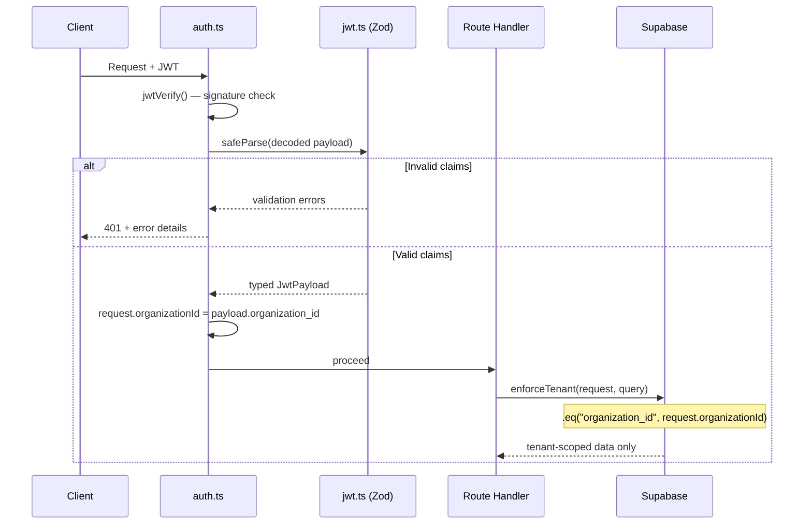
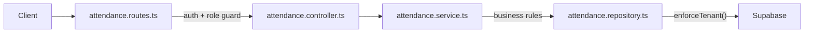
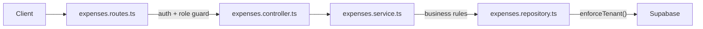
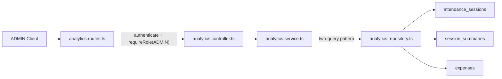

# FieldTrack 2.0 Backend — Walkthrough

## Phase 0 — Project Scaffolding

Fastify + TypeScript backend scaffold with JWT, structured logging, modular routing, Docker, and domain placeholders.

**Deviation:** replaced `ts-node-dev` with `tsx watch` (ESM compat) and added `pino-pretty` dev dep.

---

## Phase 1 — Secure Tenant Isolation Layer

### Files Changed / Created

| File | Action | Purpose |
|------|--------|---------|
| [jwt.ts](file:///d:/Codebase/FieldTrack-2.0/backend/src/types/jwt.ts) | **NEW** | Zod v4 schema for JWT payload (`sub`, `role`, `organization_id`) |
| [global.d.ts](file:///d:/Codebase/FieldTrack-2.0/backend/src/types/global.d.ts) | **MODIFIED** | Wires `JwtPayload` into Fastify types + adds `organizationId` to request |
| [auth.ts](file:///d:/Codebase/FieldTrack-2.0/backend/src/middleware/auth.ts) | **MODIFIED** | JWT verify → Zod validate → attach tenant context (or 401) |
| [tenant.ts](file:///d:/Codebase/FieldTrack-2.0/backend/src/utils/tenant.ts) | **NEW** | `enforceTenant()` — scopes any query to `request.organizationId` |

### How Tenant Enforcement Works



**Key guarantees:**
1. **No trust without validation** — decoded JWT is always schema-checked via Zod
2. **Tenant context is mandatory** — missing `organization_id` → 401
3. **Role enforcement** — only `ADMIN` or `EMPLOYEE` accepted
4. **Query-level isolation** — `enforceTenant()` ensures all DB queries are org-scoped
5. **Type safety everywhere** — `request.user` and `request.organizationId` are fully typed

---

## Phase 2 — Attendance Module (Check-in / Check-out)

### Architecture: Route → Controller → Service → Repository



### Files Created

| File | Layer | Purpose |
|------|-------|---------|
| [attendance.schema.ts](file:///d:/Codebase/FieldTrack-2.0/backend/src/modules/attendance/attendance.schema.ts) | Types | DB row type, Zod pagination schema, response interfaces |
| [attendance.repository.ts](file:///d:/Codebase/FieldTrack-2.0/backend/src/modules/attendance/attendance.repository.ts) | Repository | Supabase queries — all scoped via `enforceTenant()` |
| [attendance.service.ts](file:///d:/Codebase/FieldTrack-2.0/backend/src/modules/attendance/attendance.service.ts) | Service | Business rules: no duplicate check-in, no check-out without open session |
| [attendance.controller.ts](file:///d:/Codebase/FieldTrack-2.0/backend/src/modules/attendance/attendance.controller.ts) | Controller | Extract request data, call service, return `{ success, data }` |
| [attendance.routes.ts](file:///d:/Codebase/FieldTrack-2.0/backend/src/modules/attendance/attendance.routes.ts) | Routes | 4 endpoints with auth middleware, ADMIN guard on org-sessions |
| [supabase.ts](file:///d:/Codebase/FieldTrack-2.0/backend/src/config/supabase.ts) | Config | Supabase client singleton (service role key) |
| [role-guard.ts](file:///d:/Codebase/FieldTrack-2.0/backend/src/middleware/role-guard.ts) | Middleware | Reusable `requireRole()` factory — 403 on role mismatch |
| [errors.ts](file:///d:/Codebase/FieldTrack-2.0/backend/src/utils/errors.ts) | Utils | Added `ForbiddenError` (403) |

### Endpoints

| Method | Path | Auth | Description |
|--------|------|------|-------------|
| POST | `/attendance/check-in` | JWT | Check in (rejects if open session exists) |
| POST | `/attendance/check-out` | JWT | Check out (rejects if no open session) |
| GET | `/attendance/my-sessions` | JWT | Employee's own sessions (paginated) |
| GET | `/attendance/org-sessions` | JWT + ADMIN | All org sessions (paginated) |

### Business Rules

- **EMPLOYEE**: Can only check in if no open session; can only check out if an open session exists; cannot see other users' sessions
- **ADMIN**: Can view all sessions in their org via `/org-sessions`; cannot access other orgs
- **Tenant isolation**: Every DB query passes through `enforceTenant()`, enforcing `.eq("organization_id", ...)`
- **Query chain**: `enforceTenant()` is called before terminal operations (`.single()`, `.range()`) to preserve the filter builder type

### Example curl Requests

```bash
# Check in (requires valid JWT)
curl -X POST http://localhost:3000/attendance/check-in \
  -H "Authorization: Bearer <JWT_TOKEN>"

# Check out
curl -X POST http://localhost:3000/attendance/check-out \
  -H "Authorization: Bearer <JWT_TOKEN>"

# My sessions (paginated)
curl "http://localhost:3000/attendance/my-sessions?page=1&limit=20" \
  -H "Authorization: Bearer <JWT_TOKEN>"

# Org sessions (ADMIN only)
curl "http://localhost:3000/attendance/org-sessions?page=1&limit=20" \
  -H "Authorization: Bearer <ADMIN_JWT_TOKEN>"
```

### Verification Results

| Check | Result |
|-------|--------|
| `npm run build` (tsc) | ✅ Zero errors |
| `npm run dev` (tsx watch) | ✅ Server starts on `0.0.0.0:3000` |
| `GET /health` | ✅ `{"status":"ok","timestamp":"..."}` |

---

## Phase 3 — Location Ingestion System

### Files Created

| File | Layer | Purpose |
|------|-------|---------|
| [locations.schema.ts](file:///d:/Codebase/FieldTrack-2.0/backend/src/modules/locations/locations.schema.ts) | Types | DB row type, Zod schema (`latitude`, `longitude`, `accuracy`, `recorded_at`), response interfaces |
| [locations.repository.ts](file:///d:/Codebase/FieldTrack-2.0/backend/src/modules/locations/locations.repository.ts) | Repository | Supabase `createLocation` and `findLocationsBySession`, scoped via `enforceTenant()` |
| [locations.service.ts](file:///d:/Codebase/FieldTrack-2.0/backend/src/modules/locations/locations.service.ts) | Service | Business rules: verify open attendance session before insertion |
| [locations.controller.ts](file:///d:/Codebase/FieldTrack-2.0/backend/src/modules/locations/locations.controller.ts) | Controller | Extract request data, Zod payload validation, delegate to service, format responses |
| [locations.routes.ts](file:///d:/Codebase/FieldTrack-2.0/backend/src/modules/locations/locations.routes.ts) | Routes | 2 endpoints, both restricted to `EMPLOYEE` via role guard |

### Endpoints

| Method | Path | Auth | Description |
|--------|------|------|-------------|
| POST | `/locations` | JWT + EMPLOYEE | Record GPS point (body: lat, lng, acc, recorded_at) |
| GET | `/locations/my-route?sessionId=...` | JWT + EMPLOYEE | Get ordered location history for an active/past session |

### Business Rules

- **Attendance Dependency**: An employee *must* have an open attendance session (checked via `attendanceRepository.findOpenSession`) to record a location. 
- **Time Validation**: `recorded_at` cannot be more than 2 minutes in the future (enforced via Zod refinement).
- **Coordinate Bounds**: Latitude between `-90` and `90`, Longitude between `-180` and `180`.
- **Role Guarding**: Location ingestion is strictly limited to `EMPLOYEE` role. `ADMIN` cannot POST locations on behalf of an employee.

### Suggested Database Indexes (Phase 3 Prep)

Since `findLocationsBySession` orders by `recorded_at`, and queries are scoped to `session_id`, the `locations` table requires the following index in PostgreSQL to remain performant at scale:

```sql
CREATE INDEX idx_locations_session_recorded_at ON locations(session_id, recorded_at ASC);
```

If tenant-scoped analytics are added in the future over raw locations, a broader compound index will be needed:
```sql
CREATE INDEX idx_locations_tenant_search ON locations(organization_id, user_id, recorded_at DESC);
```

### Example curl Requests

```bash
# Record location (requires open attendance session)
curl -X POST http://localhost:3000/locations \
  -H "Authorization: Bearer <EMPLOYEE_JWT>" \
  -H "Content-Type: application/json" \
  -d '{
    "latitude": 37.7749,
    "longitude": -122.4194,
    "accuracy": 15.5,
    "recorded_at": "2026-03-03T10:00:00Z"
  }'

# Get location route for an existing session
curl "http://localhost:3000/locations/my-route?sessionId=a1b2c3d4-..." \
  -H "Authorization: Bearer <EMPLOYEE_JWT>"
```

---

## Phase 4 — Location Bulk Ingestion (Production-Optimized)

### Architecture Upgrade
Upgraded location ingestion from single-inserts to a highly optimized bulk-insert pattern, handling offline batching and high-frequency GPS tracking efficiently.

### Additional Endpoint

| Method | Path | Auth | Description |
|--------|------|------|-------------|
| POST | `/locations/batch` | JWT + EMPLOYEE | Bulk ingest up to 100 points simultaneously |

### Batch Payload Schema
```json
{
  "session_id": "9b1deb4d-3b7d-4bad-9bdd-2b0d7b3dcb6d",
  "points": [
    {
      "latitude": 37.7749,
      "longitude": -122.4194,
      "accuracy": 5.0,
      "recorded_at": "2026-03-03T10:00:00Z"
    }
  ]
}
```

### Enterprise Optimizations & Business Rules

- **1️⃣ Idempotency (Mobile Retries)**: 
  The database uses an `UPSERT` on `(session_id, recorded_at)` combined with `{ ignoreDuplicates: true }`. If the mobile client retries a batch due to a poor network connection, duplicates are cleanly discarded directly at the database layer. This guarantees route reconstruction isn't corrupted by duplicate points.
- **2️⃣ Zero Write Amplification**: 
  Instead of hitting the DB to scan for the user's active session on every GPS pulse, the client provides the `session_id` directly in the payload. The backend executes an extremely lightweight `O(1)` primary key validation (`validateSessionActive`) to confirm ownership and activity, slicing database CPU usage drastically compared to iterative scanning.
- **3️⃣ Per-User Rate Limiting**: 
  Protected by Fastify's native `@fastify/rate-limit` plugin. A custom `keyGenerator` decodes the JWT `sub` directly from the `Authorization` header during the fast `onRequest` lifecycle. The batch location ingest vector strictly drops combinations exceeding 10 requests every 10 seconds, stopping malicious overload attacks instantaneously.
- **4️⃣ Telemetry & Metrics Logging**:
  Both single and batch endpoints track executing latency via Node's `performance.now()`. Additionally, during bulk ingestion, the service calculates and logs the exact number of `duplicatesSuppressed` by comparing payload length against the successful database insert count.
- **Strict Validation**: Zod array limits (`min(1).max(100)`) prevent abuse. If even a single point in the payload violates rules, the **entire batch is rejected** (400 Bad Request).
- **Single Read / Single Write**: Validations verify the session hits the database exactly **once**. The insert operation maps all points and calls Supabase `.upsert([...rows])` to perform the bulk operation in a single network trip.

### Example Batch curl Request

```bash
curl -X POST http://localhost:3000/locations/batch \
  -H "Authorization: Bearer <EMPLOYEE_JWT>" \
  -H "Content-Type: application/json" \
  -d '{
    "session_id": "9b1deb4d-3b7d-4bad-9bdd-2b0d7b3dcb6d",
    "points": [
      {
        "latitude": 37.7749,
        "longitude": -122.4194,
        "accuracy": 5.0,
        "recorded_at": "2026-03-03T10:00:00Z"
      },
      {
        "latitude": 37.7750,
        "longitude": -122.4195,
        "accuracy": 4.5,
        "recorded_at": "2026-03-03T10:00:05Z"
      }
    ]
  }'
```

### Suggested Database Schema & Partitioning Strategy

For this level of enterprise ingestion, the `locations` table requires specific indexing:

```sql
-- 1) Guaranteed Idempotency (critical for Supabase onConflict)
CREATE UNIQUE INDEX uniq_session_timestamp ON locations(session_id, recorded_at);

-- 2) Fast Route Reconstruction
CREATE INDEX idx_locations_session_recorded_at ON locations(session_id, recorded_at ASC);

-- 3) (Future) Analytics Expansion
CREATE INDEX idx_locations_tenant_search ON locations(organization_id, user_id, recorded_at DESC);
```

**Strategy for Scale:**
1. **Partition by Range (Time)**: Transition the `locations` table to a PostgreSQL partitioned table grouping by `recorded_at` (e.g., month-by-month partitions).
---

## Phase 6 — Distance Engine & Session Summary

### Architecture Overview
Introduced a computational engine designed to passively or actively calculate Haversine distances based on an employee's location pings throughout their `attendance_session`. The summaries are stored in a new `session_summaries` table.

### Schema: `session_summaries`

| Column | Type | Description |
|--------|------|-------------|
| `session_id` | uuid (PK) | Links directly to `attendance_sessions` |
| `organization_id`| uuid | Tenant Isolation Key |
| `user_id` | uuid | Employee ID |
| `total_distance_meters`| double precision (float) | Cumulative calculated distance |
| `total_points` | integer | Total GPS ticks ingested |
| `duration_seconds` | integer | `check_out - check_in` |
| `updated_at` | timestamptz | Last recalculated timestamp |

### Endpoints

| Method | Path | Auth | Description |
|--------|------|------|-------------|
| POST | `/attendance/check-out` | JWT | Existing endpoint; now **automatically** triggers the Distance Engine. |
| POST | `/attendance/:sessionId/recalculate` | JWT | Explicitly recalculates distance if delayed offline points are synced. |

### Performance Considerations & Idempotency

- **O(1) Memory Streaming**: A user can log upwards of 30,000 GPS points in a single 12-hour factory shift. Instead of crashing the Node.js process by pulling all 30k generic rows into RAM at once, the Distance Engine utilizes a strictly chunked streaming architecture.
  - The repository's `findPointsForDistancePaginated` method fetches exactly 1,000 `.select("latitude, longitude, recorded_at")` lightweight objects per network trip.
  - The calculation loop accurately tracks the absolute *last* point of the `previousChunk` to securely calculate the bridge distance to the *first* point of the `currentChunk` without disconnecting the route line mathematically.
  - This allows infinite scalability. The engine runs in strict O(1) memory space, rendering memory leaks mathematically impossible regardless of session duration.
- **Hardware-Friendly Math**: Distance is parsed cumulatively using the native Haversine formula calculation over sequential point pairs (`p[i]` against `p[i+1]`).
- **Telemetry Execution Timer**: The entire stream operation tracks `executionTimeMs` via Node's `performance.now()` in the service layer, writing total execution durations to Pino logs for immediate Datadog observability.
- **Idempotency via Upsert**: Because calculating distances mathematically resets the `session_summaries` dataset on conflict, calling the explicitly exposed `recalculate` reliably regenerates the absolute ground truth—safely overwriting legacy computations.

---

## Phase 7 — Asynchronous Background Workers (Decoupled Compute)

### Architecture Overview
Calculating rigorous physical distance on dense geometric location arrays—especially across chunks—takes noticeable CPU cycles (`~50ms` - `400ms`). 
To ensure the primary public API remains perfectly responsive to the mobile app, the `POST /attendance/check-out` route has been entirely decoupled from the actual distance computation layer.

### How it Works
1. **Check-out**: The user calls the `/check-out` API. The database successfully logs the `check_out_time` to close their attendance session.
2. **Instant Return**: The endpoint instantly fires the session `uuid` into an isolated Node.js Worker-Queue Array (`export const queue`), and responds with an immediate `200 OK` `success: true` to unblock the mobile UI.
3. **Background Worker**: `src/workers/queue.ts` loops indefinitely on an asynchronous timeline outside the immediate HTTP request lifecycle. It plucks pending keys off the queue, generates mock system requests to bypass normal session requirements, and mathematically crunches the dense Haversine Streaming algorithms asynchronously.
4. **Active Set Guard**: To avoid overlapping recalculation scenarios (e.g. queue processing vs random manual recalculation triggers), an external `Set<string>` tracks the currently executing computation jobs, throwing instant `409 Conflict` rejections if a client manually tries to recalculate a session that the worker is simultaneously processing.

### Architectural Risks & Limitations (MVP Scope)
While this in-memory queue decouples latency from the API lifecycle, it must be acknowledged that it introduces specific limitations addressed in future production stages:
- **Main Event Loop Blocking**: The asynchronous queue does **not** rely on `worker_threads` or true parallel `child_process` computing. It is purely asynchronous relative to HTTP. The heavy Haversine computation loop still utilizes the primary single-threaded Node.js event loop, which means intensive, sustained execution over millions of iterations can temporarily starve parallel I/O requests.
- **In-Memory Volatility**: The queue (`export const queue: string[] = []`) is non-durable. In the result of a catastrophic `SIGKILL` or server restart, all queued un-crunched check-outs are destroyed. 
- **Horizontal Scaling Limits**: Deploying multiple backend instances (e.g., via AWS or Vercel edge nodes) spawns multiple independent memory pools. They do not share state, risking race conditions and potentially duplicating recalculations across separated cluster deployments. This necessitates an external durable state layer (e.g., Redis via BullMQ) at true enterprise scale.

---

## Phase 7.5 — Crash Recovery & Self-Healing

### Architecture Overview
Because the MVP asynchronous distance engine queue resides entirely in volatile memory, a hard backend server crash (e.g. out-of-memory, SIGKILL, or simple deploy restart) will immediately destroy all pending computations for employees that checked out precisely during the outage window.

To guarantee **Eventual Consistency**, a self-healing bootstrap daemon was added to the `app.ts` initialization lifecycle.

1. **Service-Role Table Scan**: When the Node environment boots, it immediately bypasses Tenant RLS via the Supabase Service Key to query a highly optimized Left-Join across all `attendance_sessions` and `session_summaries`.
2. **Identifying Orphans**: It isolates any session that is definitively closed (`check_out_at IS NOT NULL`), but either lacks a corresponding mathematically generated `session_summaries` row, or has a `session_summaries.updated_at` timestamp chronologically *older* than the `check_out_at` boundary (meaning a generic mid-session recalculation fired, but the final Check-Out generation dropped).
3. **Queue Repopulation**: Before the Fastify server formally accepts new port traffic, all orphaned `session_id` strings are automatically intercepted and injected back into the `src/workers/queue.ts` asynchronous memory loop.
4. **Collision Avoidance**: If an admin manually clicked "Recalculate Session" exactly while the server was booting, the worker respects the `Set<string>` actively processing tracker to ignore duplicative queue stacking.

This ensures no employee attendance distance metric is ever permanently stranded.

---

## Phase 8 — Expense Module & Architecture Cleanup

### Part 1 — Domain Layer Removal

The `src/domain/` directory contained five empty placeholder folders (`attendance/`, `expense/`, `location/`, `organization/`, `user/`) from the initial scaffold. No code referenced them. They have been permanently deleted.

**Architectural decision:** FieldTrack 2.0 standardizes on a strict **Layered Architecture** (`routes → controller → service → repository`) co-located inside `src/modules/`. DDD-style domain objects are not introduced. This keeps each module self-contained and avoids premature abstraction.

---

### Part 2 — Secured `/internal/metrics`

**Prior state:** `GET /internal/metrics` was completely unauthenticated — any internet client that reached the server could query operational telemetry.

**Fix applied in `src/routes/internal.ts`:**

```typescript
app.get(
  "/internal/metrics",
  {
    preHandler: [authenticate, requireRole("ADMIN")],
  },
  async (_request, reply) => { ... }
);
```

- JWT authentication (`authenticate`) runs first — unsigned or expired tokens receive a `401`.
- Role guard (`requireRole("ADMIN")`) runs second — valid EMPLOYEE tokens receive a `403`.
- No IP filtering or allowlist — identity is enforced by cryptographic token, not network topology.
- `EMPLOYEE` role cannot access metrics under any circumstances.

---

### Part 3 — Expense Module

#### Architecture: Route → Controller → Service → Repository



#### Files Created

| File | Layer | Purpose |
|------|-------|---------|
| `expenses.schema.ts` | Types | DB row type, Zod body schemas, pagination schema, response interfaces |
| `expenses.repository.ts` | Repository | All Supabase queries — SELECT/UPDATE scoped via `enforceTenant()` |
| `expenses.service.ts` | Service | Business rules, structured event logs (`expense_created`, `expense_approved`, `expense_rejected`) |
| `expenses.controller.ts` | Controller | Zod validation, service delegation, `{ success, data }` shape |
| `expenses.routes.ts` | Routes | 4 endpoints with auth middleware, role guards, rate limiting on creation |

#### Database Schema

```sql
CREATE TABLE expenses (
  id               uuid PRIMARY KEY DEFAULT gen_random_uuid(),
  organization_id  uuid        NOT NULL,
  user_id          uuid        NOT NULL,
  amount           numeric     NOT NULL CHECK (amount > 0),
  description      text        NOT NULL,
  status           text        NOT NULL DEFAULT 'PENDING'
                               CHECK (status IN ('PENDING', 'APPROVED', 'REJECTED')),
  receipt_url      text,
  created_at       timestamptz NOT NULL DEFAULT now(),
  updated_at       timestamptz NOT NULL DEFAULT now()
);
```

#### Endpoints

| Method | Path | Auth | Description |
|--------|------|------|-------------|
| `POST` | `/expenses` | JWT + EMPLOYEE | Create expense (status forced to `PENDING`). Rate limited: 10/min per user. |
| `GET` | `/expenses/my` | JWT + EMPLOYEE | Own expenses, paginated (`page`, `limit`) |
| `GET` | `/admin/expenses` | JWT + ADMIN | All org expenses, paginated |
| `PATCH` | `/admin/expenses/:id` | JWT + ADMIN | Approve or reject a `PENDING` expense |

#### Business Rules

- **EMPLOYEE can only create and view their own expenses.** The service always sets `status = PENDING` on creation — the body cannot override this.
- **EMPLOYEE cannot modify an expense after creation.** There is no update endpoint for employees.
- **ADMIN can view all org expenses** scoped to their organization via `GET /admin/expenses`.
- **ADMIN can only transition `PENDING` → `APPROVED` or `PENDING` → `REJECTED`.** The service rejects any action on an already-actioned expense with `400 Bad Request`, preventing double-processing.
- **ADMIN cannot touch other organizations expenses.** All repository calls use `enforceTenant()`, which appends `.eq("organization_id", request.organizationId)`.

#### Zod Validation Rules

| Field | Rule |
|-------|------|
| `amount` | Required, `number`, must be `> 0` |
| `description` | Required, `string`, min 3 chars, max 500 chars |
| `receipt_url` | Optional, must be a valid URL when provided |
| `status` (PATCH) | Required, must be `APPROVED` or `REJECTED` |
| `page` / `limit` | Coerced integers; `page >= 1`, `1 <= limit <= 100` |

#### Tenant Isolation

All SELECT and UPDATE paths pass through `enforceTenant()`:

```typescript
const baseQuery = supabase.from("expenses").select("*").eq("id", expenseId);
const { data, error } = await enforceTenant(request, baseQuery).single();
```

`enforceTenant()` appends `.eq("organization_id", request.organizationId)` before the terminal operation. INSERTs explicitly set `organization_id: request.organizationId` — no `enforceTenant()` needed for writes. This pattern is consistent across all modules.

#### Structured Log Events

| Event tag | Trigger | Fields logged |
|-----------|---------|---------------|
| `expense_created` | Successful `POST /expenses` | `expenseId`, `userId`, `organizationId`, `amount` |
| `expense_approved` | `PATCH` with `status: APPROVED` | `expenseId`, `userId`, `adminId`, `organizationId`, `amount`, `status` |
| `expense_rejected` | `PATCH` with `status: REJECTED` | `expenseId`, `userId`, `adminId`, `organizationId`, `amount`, `status` |

#### Rate Limiting

`POST /expenses` is rate-limited at 10 requests per 60 seconds per user identity. The `keyGenerator` decodes the JWT `sub` directly from the `Authorization` header (same pattern as `attendance.routes.ts` and `locations.routes.ts`) so the limit is per-identity, not per-IP. Key format: `expense-create:<sub>`.

#### Index Strategy

```sql
-- 1) Fast employee self-service read (most common path)
CREATE INDEX idx_expenses_user_created_at
  ON expenses(user_id, created_at DESC);

-- 2) Admin org-wide paginated listing, newest-first
CREATE INDEX idx_expenses_org_created_at
  ON expenses(organization_id, created_at DESC);

-- 3) Analytics and status-based filtering per org
CREATE INDEX idx_expenses_org_status
  ON expenses(organization_id, status);
```

#### Example curl Requests

```bash
# Create an expense (EMPLOYEE)
curl -X POST http://localhost:3000/expenses \
  -H "Authorization: Bearer <EMPLOYEE_JWT>" \
  -H "Content-Type: application/json" \
  -d '{"amount": 49.99, "description": "Taxi to client site", "receipt_url": "https://cdn.example.com/receipt.jpg"}'

# View own expenses (EMPLOYEE, paginated)
curl "http://localhost:3000/expenses/my?page=1&limit=20" \
  -H "Authorization: Bearer <EMPLOYEE_JWT>"

# View all org expenses (ADMIN)
curl "http://localhost:3000/admin/expenses?page=1&limit=50" \
  -H "Authorization: Bearer <ADMIN_JWT>"

# Approve an expense (ADMIN)
curl -X PATCH "http://localhost:3000/admin/expenses/<EXPENSE_UUID>" \
  -H "Authorization: Bearer <ADMIN_JWT>" \
  -H "Content-Type: application/json" \
  -d '{"status": "APPROVED"}'

# Reject an expense (ADMIN)
curl -X PATCH "http://localhost:3000/admin/expenses/<EXPENSE_UUID>" \
  -H "Authorization: Bearer <ADMIN_JWT>" \
  -H "Content-Type: application/json" \
  -d '{"status": "REJECTED"}'

# Query secured metrics (ADMIN only — was previously public)
curl http://localhost:3000/internal/metrics \
  -H "Authorization: Bearer <ADMIN_JWT>"
```

### Verification Results

| Check | Result |
|-------|--------|
| `npx tsc --noEmit` | Zero errors |
| Domain layer (`src/domain/`) removed | Confirmed — no remaining imports |
| `/internal/metrics` secured | `authenticate` + `requireRole("ADMIN")` applied |
| Expense module files | 5 files created in `src/modules/expenses/` |
| Routes registered in `routes/index.ts` | `expensesRoutes` registered |

---

## Phase 9 — Admin Analytics Layer

### Architecture: Route → Controller → Service → Repository



### Files Created

| File | Layer | Purpose |
|------|-------|---------|
| `analytics.schema.ts` | Types | Zod query param schemas, response data types, internal row interfaces |
| `analytics.repository.ts` | Repository | Minimal-select DB queries; all scoped via `enforceTenant()` |
| `analytics.service.ts` | Service | Aggregation logic, date validation, grouping by user_id |
| `analytics.controller.ts` | Controller | Zod parsing, service delegation, `{ success, data }` response shape |
| `analytics.routes.ts` | Routes | 3 endpoints; all require `authenticate` + `requireRole("ADMIN")` |

---

### Endpoints

| Method | Path | Auth | Description |
|--------|------|------|-------------|
| `GET` | `/admin/org-summary` | JWT + ADMIN | Org-wide session/expense aggregate |
| `GET` | `/admin/user-summary` | JWT + ADMIN | Per-user session/expense aggregate |
| `GET` | `/admin/top-performers` | JWT + ADMIN | Ranked leaderboard by metric |

All three endpoints accept optional `from` and `to` ISO-8601 date query parameters. If both are provided and `from > to`, the service throws `400 Bad Request`.

---

### Endpoint 1 — GET /admin/org-summary

**Query params:** `from` (optional ISO-8601), `to` (optional ISO-8601)

**Response:**
```json
{
  "success": true,
  "data": {
    "totalSessions": 142,
    "totalDistanceMeters": 87432.5,
    "totalDurationSeconds": 312840,
    "totalExpenses": 31,
    "approvedExpenseAmount": 1249.75,
    "rejectedExpenseAmount": 89.99,
    "activeUsersCount": 18
  }
}
```

**Aggregation strategy:**
1. Query `attendance_sessions` for `{id, user_id}` within date range — org-scoped via `enforceTenant()`.
2. Query `session_summaries` for those session IDs — org double-checked via `enforceTenant()`.
3. Accumulate `total_distance_meters` and `duration_seconds`; collect distinct `user_id` into a `Set`.
4. Query `expenses` for `{amount, status}` within same date range.
5. Aggregate expense counts and totals by status in a single pass.

**Why session_summaries instead of attendance_sessions + locations:**  
`session_summaries` contains one pre-computed row per closed session. Reading distance and duration from it avoids scanning the `locations` table which can hold 30,000+ GPS points per session. This makes org-level aggregation O(sessions) instead of O(GPS points).

---

### Endpoint 2 — GET /admin/user-summary

**Query params:** `userId` (UUID, required), `from` (optional), `to` (optional)

**Response:**
```json
{
  "success": true,
  "data": {
    "sessionsCount": 12,
    "totalDistanceMeters": 7821.3,
    "totalDurationSeconds": 28800,
    "totalExpenses": 4,
    "approvedExpenseAmount": 312.50,
    "averageDistancePerSession": 651.78,
    "averageSessionDurationSeconds": 2400
  }
}
```

**User validation:**  
Before running any aggregation the service calls `checkUserHasSessionsInOrg()` — a lightweight `.select("id").limit(1)` on `attendance_sessions` with `user_id` + `enforceTenant()`. If no session exists for this user in the org, `404 Not Found` is returned. This distinguishes "user not in this org" from "user exists but has zero sessions in this date range."

**Averages:**  
`averageDistancePerSession` and `averageSessionDurationSeconds` are computed in the service layer. Both return `0` when `sessionsCount === 0` to avoid division-by-zero.

---

### Endpoint 3 — GET /admin/top-performers

**Query params:** `metric` (required: `distance` | `duration` | `sessions`), `from` (optional), `to` (optional), `limit` (1–50, default 10)

**Response (metric=distance):**
```json
{
  "success": true,
  "data": [
    { "userId": "uuid-1", "totalDistanceMeters": 12340.5 },
    { "userId": "uuid-2", "totalDistanceMeters": 9876.0 }
  ]
}
```

Only the relevant metric field is included in each entry; unused metric fields are omitted to keep responses minimal.

**Aggregation strategy:**
1. Same two-query pattern: resolve session IDs, then fetch `session_summaries` rows.
2. Group by `user_id` in a single O(n) pass using a `Map`. Each entry accumulates `totalDistanceMeters`, `totalDurationSeconds`, and `sessionsCount`.
3. Sort entries descending by the chosen metric.
4. Slice to `limit` and shape output (only the sorted-by field included per entry).

**`metric` enum validation:**  
Zod validates `metric` against `["distance", "duration", "sessions"]`. Any other value returns `400 Bad Request` before the DB is touched.

---

### Aggregation Strategy and Performance

#### Two-Query Pattern

All session-based analytics use a consistent two-query approach:

```
Query 1: attendance_sessions
  SELECT id, user_id
  WHERE organization_id = :orgId
    AND check_in_at >= :from
    AND check_in_at <= :to

Query 2: session_summaries
  SELECT user_id, total_distance_meters, duration_seconds
  WHERE session_id IN (:sessionIds)
    AND organization_id = :orgId   ← defense-in-depth via enforceTenant()
```

This avoids:
- Raw SQL joins
- N+1 query patterns
- Loading raw GPS location data
- Full-table scans (when indexes are in place)

#### Why Not Direct session_summaries Scan

PostgREST (Supabase's REST interface) does not expose SQL aggregate functions (`SUM`, `COUNT DISTINCT`, `GROUP BY`) via the standard supabase-js API without raw SQL. Rather than using `supabase.rpc()` (which requires stored procedures), all aggregation is performed in application memory on pre-filtered, minimal-column result sets.

This is safe and efficient because:
- `session_summaries` rows are pre-aggregated (one row per closed session)
- Only 2 numeric columns + `user_id` are fetched per row (~40 bytes)
- Typical date-range queries for 1–3 months return hundreds to low-thousands of rows

---

### Tenant Isolation

Every repository method calls `enforceTenant()` which appends `.eq("organization_id", request.organizationId)` before the terminal operation. For the two-query pattern, both queries are independently enforced:

- `attendance_sessions` query: scoped by `organization_id`
- `session_summaries` query: double-scoped by `organization_id` in addition to the `session_id IN (...)` filter — an admin from org A cannot resolve session IDs from org B because the first query itself is org-locked

---

### Zod Validation Summary

| Parameter | Rule |
|-----------|------|
| `from` | Optional, must be ISO-8601 with timezone offset when provided |
| `to` | Optional, must be ISO-8601 with timezone offset when provided |
| `from` + `to` | When both present: `from` must not be later than `to` (service-layer check) |
| `userId` | Required for user-summary; must be a valid UUID |
| `metric` | Required for top-performers; must be `distance`, `duration`, or `sessions` |
| `limit` | Optional; coerced integer, 1–50, default 10 |

---

### Index Dependencies

The analytics layer relies on the following indexes for efficient execution. These should be created in the database before deploying Phase 9:

```sql
-- Range scan for session list resolution
-- Used by: org-summary, user-summary, top-performers (first query)
CREATE INDEX idx_attendance_sessions_org_checkin
  ON attendance_sessions(organization_id, check_in_at DESC);

-- User-scoped range scan
-- Used by: user-summary (first query)
CREATE INDEX idx_attendance_sessions_user_checkin
  ON attendance_sessions(user_id, organization_id, check_in_at DESC);

-- IN-list lookup from resolved session IDs
-- Used by: all three endpoints (second query)
CREATE INDEX idx_session_summaries_session_org
  ON session_summaries(session_id, organization_id);

-- Expense range scan (already recommended in Phase 8; listed here for completeness)
CREATE INDEX idx_expenses_org_created_at
  ON expenses(organization_id, created_at DESC);

-- User-scoped expense scan
CREATE INDEX idx_expenses_user_org
  ON expenses(user_id, organization_id, created_at DESC);
```

---

### Example curl Requests

```bash
# Org summary — last 30 days
curl "http://localhost:3000/admin/org-summary?from=2026-02-01T00:00:00Z&to=2026-03-03T23:59:59Z" \
  -H "Authorization: Bearer <ADMIN_JWT>"

# Org summary — all time (no date filter)
curl "http://localhost:3000/admin/org-summary" \
  -H "Authorization: Bearer <ADMIN_JWT>"

# User summary
curl "http://localhost:3000/admin/user-summary?userId=9b1deb4d-3b7d-4bad-9bdd-2b0d7b3dcb6d&from=2026-02-01T00:00:00Z&to=2026-03-03T23:59:59Z" \
  -H "Authorization: Bearer <ADMIN_JWT>"

# Top 5 by distance
curl "http://localhost:3000/admin/top-performers?metric=distance&limit=5&from=2026-02-01T00:00:00Z" \
  -H "Authorization: Bearer <ADMIN_JWT>"

# Top 10 by session count (default limit)
curl "http://localhost:3000/admin/top-performers?metric=sessions" \
  -H "Authorization: Bearer <ADMIN_JWT>"

# Invalid date range — returns 400
curl "http://localhost:3000/admin/org-summary?from=2026-03-01T00:00:00Z&to=2026-02-01T00:00:00Z" \
  -H "Authorization: Bearer <ADMIN_JWT>"
```

### Verification Results

| Check | Result |
|-------|--------|
| `npx tsc --noEmit` | Zero errors |
| All endpoints require ADMIN | `authenticate` + `requireRole("ADMIN")` on all routes |
| No `select("*")` in analytics | Only named columns fetched |
| No raw SQL | Supabase JS client only |
| `from > to` guard | `BadRequestError` thrown in service before any DB call |
| `userId` validation | `checkUserHasSessionsInOrg()` before aggregation |
| Routes registered | `analyticsRoutes` registered in `routes/index.ts` |
